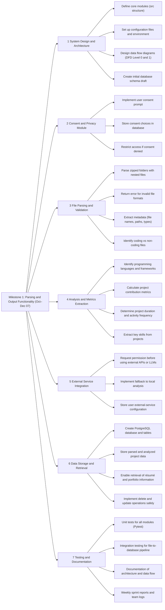
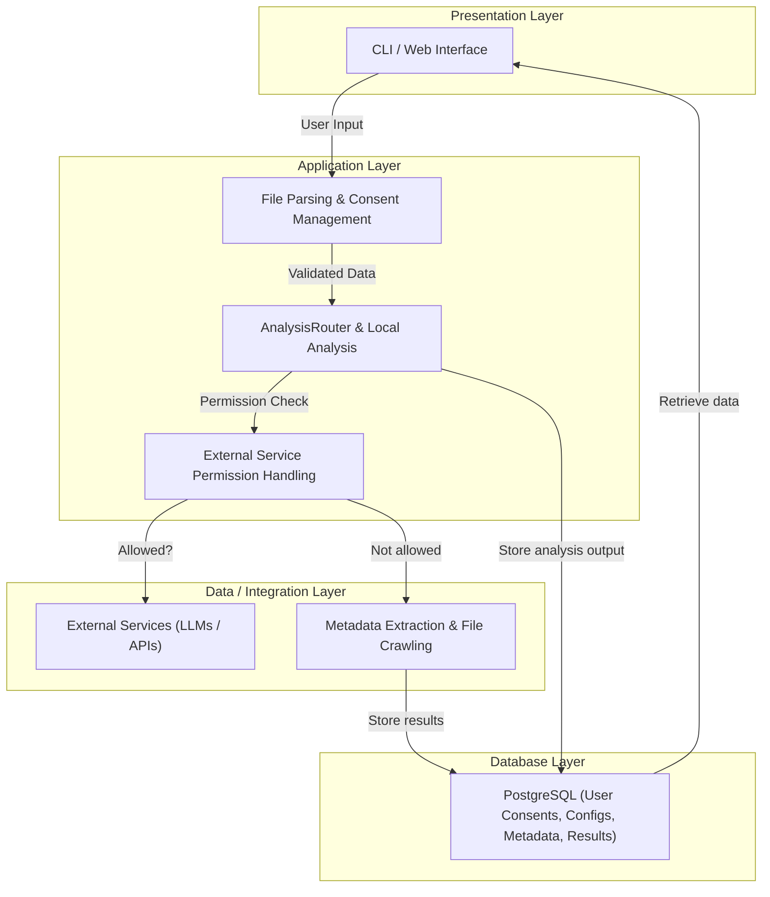

# **Milestone 1 Overview — Mining Digital Work Artifacts**

This document includes both the **Work Breakdown Structure (WBS)** and the **System Architecture Diagram** for **Milestone #1 (October – December 07)** of the *Mining Digital Work Artifacts* project.

---

## **Work Breakdown Structure (WBS)**

---

## **System Architecture**

This layered architecture diagram provides a high-level view of how the system interacts across components and data flows.

### **Architecture Overview**

The architecture is organized into **four primary layers**, each with a specific responsibility:

**Presentation Layer**
   – user facing interfaces for interaction and output 
   - Display project summaries, metrics, and skill visualizations
   - Support future React-based Web Dashboard
     
**Application Layer** 
  – core business logic for analysis and decision-making  
  - Parse and validate ZIP files
  - Route analysis tasks (local vs external)
    
**Data / Integration Layer**
  – mediates between logic and storage or external APIs
  - Handle optional connections to external LLMs or APIs (if user allows)
  - Extract file metadata (name, type, size, structure)
    
**Database Layer**
  – persistent storage for structured data and metadata
  - Provides durable, structured storage for all collected and analyzed data.
  - Support data retrieval for résumé and portfolio generation

## **DFD level 1**

### **Overview**
This DFD represents the **data movement and processing** inside the system when a user uploads, analyzes, and retrieves work artifacts.  
It highlights the main external entities, processes, and data stores involved in the workflow.

---

#### 1. **External Entities**
- **Early Professionals / Students**  
  The main users of the system who provide login credentials and initiate artifact scanning.  
  They want to analyze their work output and generate summarized portfolios.

- **HR Representative**  
  Acts as a facilitator or stakeholder who can provide **user details** or verify data sources (for professional data mining).

- **Data Source**  
  Represents external systems, repositories, or local folders containing digital work artifacts — such as documents, code, media, or design files.

---

#### 2. **Core Process: Mining Digital Work Artifacts**
This is the **main system** responsible for analyzing digital files.

**Inputs:**
- User details (from HR or direct login)
- Extracted raw data (from data sources)

**Processes:**
- Scans and parses the digital artifacts
- Extracts metadata (file type, timestamps, contributions)
- Performs content and activity analysis
- Summarizes insights (skills, project duration, contributions, etc.)

**Outputs:**
- Result data ready for visualization and portfolio storage

---

#### 3. **Supporting Processes**

- **Digital Artifacts System**  
  The entry point where user operations (like “Scan Artifacts”) are initiated.  
  It requires login credentials and sends **user detail** information downstream.

- **HR Representative**  
  Validates user identity and provides additional metadata (if applicable).

- **Data Source**  
  Supplies **raw digital artifacts** for analysis. It interacts with the system by sending **data extraction results** to the Mining system.

---

#### 4. **Downstream Systems**

- **Portfolio Store System**  
  After analysis, results (such as summary reports or extracted skills) are sent here for **storage and visualization**.  
  It converts processed results into structured **portfolio data**.

- **Portfolio Database**  
  The storage backend where all summarized user portfolios and extracted data insights are kept for retrieval.

---
