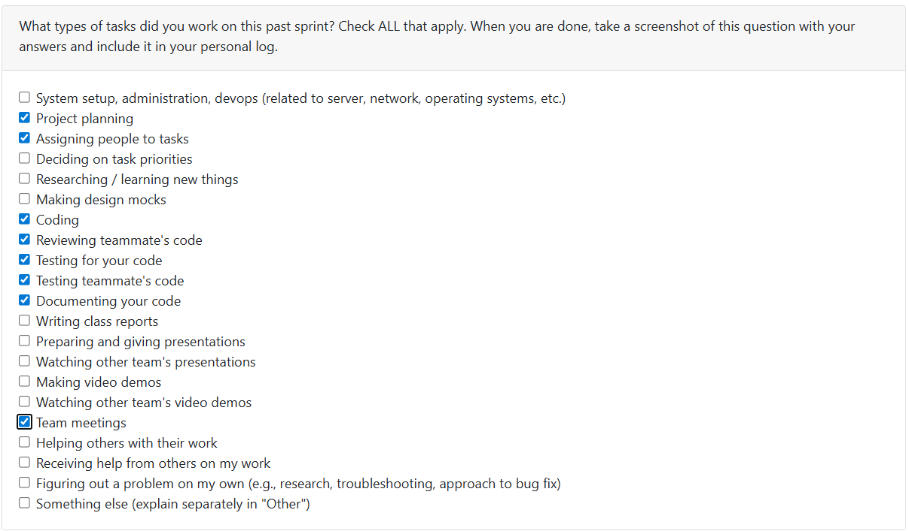

# T2Week 10: 2026/3/9 – 2026/3/15

## Tasks Worked On

---

## Weekly Goals Recap
This week, our team is focus on the improve the frontend and fix potential bugs.

---

## My Contributions
This week I improve frontend resume features and do refactoring

### issue developed:
[Frontend resume formator](https://github.com/COSC-499-W2025/capstone-project-team-9/pull/361)

This PR enable the frontend to show the full user resume

- Write resume-formatter.js for present the full generated resume in frontend when user click the load resume.
- Remove the old resume present codes form dashboard.html

[Front end refactor: util.js and api.js](https://github.com/COSC-499-W2025/capstone-project-team-9/pull/366)

This PR split the codes form the dashboard.html into different .js file

- util.js contain the core utile functions in dashboard
- api.js contain the api communicate codes in dashbaord
- All edit is about front end, should not break any thing
- Update the test in need

### PR reviewed: 
1. [Customizable portfolio](https://github.com/COSC-499-W2025/capstone-project-team-9/pull/360)
2. [Frontend and Menu Rework](https://github.com/COSC-499-W2025/capstone-project-team-9/pull/372)
3. [Resume api integration](https://github.com/COSC-499-W2025/capstone-project-team-9/pull/373)
4. [fix generate resume bug](https://github.com/COSC-499-W2025/capstone-project-team-9/pull/374)

### Went well:
Obviously improve the frontend features.
### Not well:
The bussiness bug that fixed last week appeared again.
### Next cycle:
Develop milestone3 jobs.
