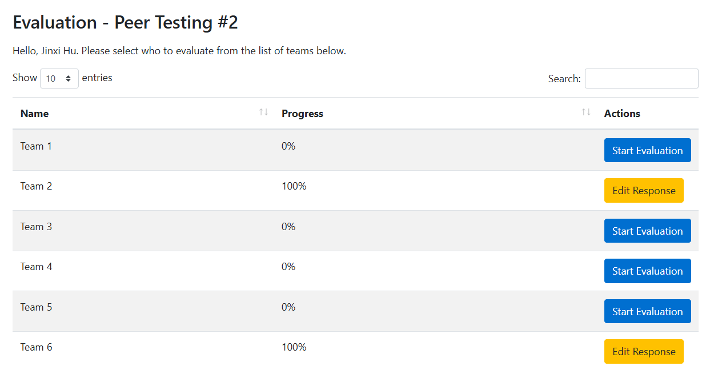

# T2Week 11: 2026/3/16 – 2026/3/22

## Tasks Worked On

---

## Weekly Goals Recap
This week, our team is focus on the finish off the mileston3 jobs.

---

## My Contributions
This week I am focus on the front end refactor.

### issue developed:
[remove duplicate codes](https://github.com/COSC-499-W2025/capstone-project-team-9/pull/381)

This PR re-do and apply the api.js and util.js.

- Which remove the duplicated codes from the dashboard.html
- Remove the duplicate codes form index and public.
- Now all front end api and util js functions should use api.js and util.js.

[Refactor: protfolio dashboard.js and portfolio customization.js](https://github.com/COSC-499-W2025/capstone-project-team-9/pull/383)

This PR split the protfolioDashboard.js and portfolioCustomization.js from the dashboard.js

- Move codes into modules and remove duplicated codes
- Improve the code readability and maintainability
- Only frontend change, should not cause problems

### PR reviewed: 
1. [portfolio ui changes](https://github.com/COSC-499-W2025/capstone-project-team-9/pull/379)
2. [fix: compute LOC from file content instead of casting to int; update tests accordingly](https://github.com/COSC-499-W2025/capstone-project-team-9/pull/380)
3. [done testing](https://github.com/COSC-499-W2025/capstone-project-team-9/pull/384)

### Went well:
Make the dashboard codes more readable.
### Not well:
Found that the front end currently no able to generate pdf resume.
### Next cycle:
Do more refactor and bug fix.
