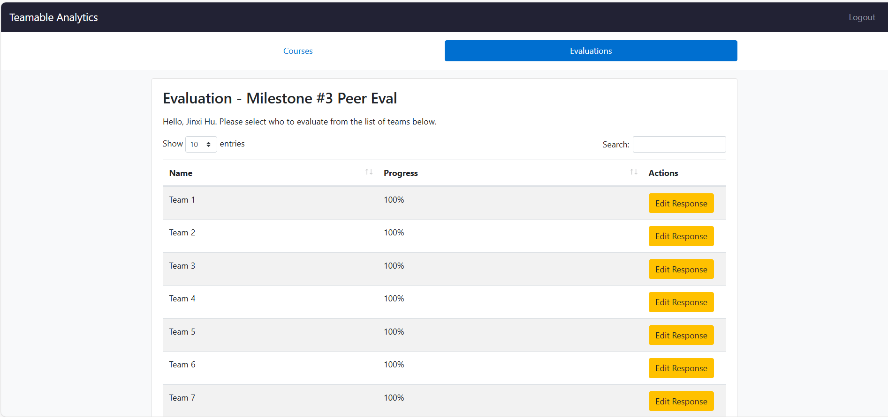

# T2Week 11: 2026/3/16 – 2026/3/22

## Tasks Worked On

---

## Weekly Goals Recap
This week, our team is focus on bug fix and test.

---

## My Contributions
This week I am focus on fix the frontend bugs and add missing features.

### issue developed:
[issue389: eanble cust project name](https://github.com/COSC-499-W2025/capstone-project-team-9/pull/392)

This PR implement the customization project name in frontend, and also do some refactor

- Modify dashboard and app.py to enable user can enter name for project when upload
- Split upload file js codes form dashboard into a isolated js file.

[bug fix/project delete](https://github.com/COSC-499-W2025/capstone-project-team-9/pull/393)

This PR fix bug of unable to delete project

- right transfer the user_name parameter to the back end.
- remove the duplicated codes in project.py
- Update the test in need

[issue391：fix list project page bugs](https://github.com/COSC-499-W2025/capstone-project-team-9/pull/394)

This PR is for fixing some bugs and improve in list project page.

- Fixed the authorization fail bugs when user enter list project page and save summary
- Make the generated summary be store into DB, so that the summary could be long term used
- Add button for user to regenerate summary by AI
- Fix the bug of when reset the page, the summary of project would dispare.

### PR reviewed: 
1. [test: add db failure and request context edge case tests](https://github.com/COSC-499-W2025/capstone-project-team-9/pull/387)
2. [all more tests for utils](https://github.com/COSC-499-W2025/capstone-project-team-9/pull/395)

### Went well:
Fixed mnay bugs.
### Not well:
May not have time to test full system.
### Next cycle:
No more next cycle.
