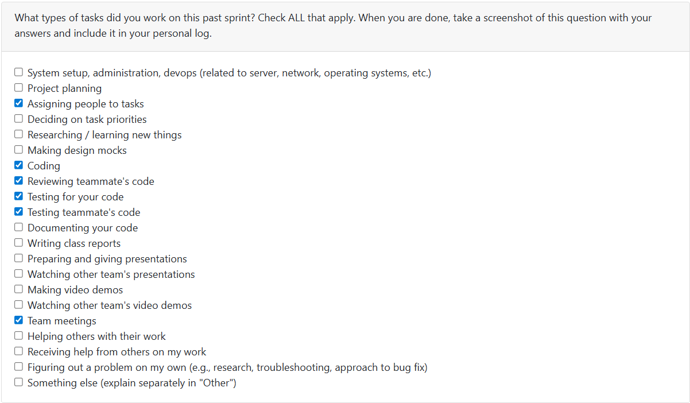

# T2Week 3: 2026/1/19 – 2026/1/25

## Tasks Worked On

---

## Weekly Goals Recap
This week, our team keep develop the milstone 2 things. We developed a basic fround end, improve the backend functions. 

---

## My Contributions
This week I am keep developing the user data isolation feature.
- [Finished] Isolation in portfolio feature; isolation in resume feature; isolation in project rank feature.
- [Additional] Add a development evnironment only tool to manage the data base.

### issue developed:
[Add a DB manage tool, and delete useless files](https://github.com/COSC-499-W2025/capstone-project-team-9/pull/238)
The current main branch actually do not have any breaking errors, but the local data base may cause problems.
- Add a development tool called drop_table.py. This file is used to drop data tables in data base, this would same time.
- Add security check for the drop_table.py to ensure it wont work in business environment.

[Issue127-2: implement data isolation in portfolio feature](https://github.com/COSC-499-W2025/capstone-project-team-9/pull/240)
A small PR, only change few lines of codes on portfolio_manager.py and portofolio_display.py.
- Add auto get current user function in this two files
- update the test file

[issue127-3: implement user data isolation in resume function](https://github.com/COSC-499-W2025/capstone-project-team-9/pull/241)
This PR implement the data isolation in resume feature, and fix some old Bugs.
- Change the generated_resumes data tables, which reference user_name from user_information table as the forigen key.
- Change the CRUDs of generated_resumes table to fit the new data table and implement the resume isolation between different users.
- Add codes to update the old data table
- Fix the Bug which print 'Error: No user logged in' in project summary, portfolio and resume.
- Update the tests.

[issue127-5: implement the data isolation on project summary and rank feature](https://github.com/COSC-499-W2025/capstone-project-team-9/pull/250)
This PR implement the data isolation in project rank feature based on user_name.
- Add user_name as a foreign key into the project_rankings data table.
- Update the functions in ranking_storage.py, make the could use user_name as a parameter to do their job.
- updata the test files in need
  
### PR reviewed: 
1. [Issue #227-#230 (Project API Endpoints)](https://github.com/COSC-499-W2025/capstone-project-team-9/pull/231)
2. [Frontend - Login Page](https://github.com/COSC-499-W2025/capstone-project-team-9/pull/233)
3. [Simple Frontend](https://github.com/COSC-499-W2025/capstone-project-team-9/pull/234)
4. [API Endpoints Resume, Skills, Portfolio](https://github.com/COSC-499-W2025/capstone-project-team-9/pull/239)
5. [Simple Bug fix](https://github.com/COSC-499-W2025/capstone-project-team-9/pull/242)

### Went well:
Split the data isolation work into multiple sub issues, and finished most of them.
### Not well:
The amount of data isolation are more than I expect, I spend extral time on them. This cause me do not have time to develop the frount end related things this week. 
### Next cycle:
Finish the data isolation feature, and do some frount API things.
