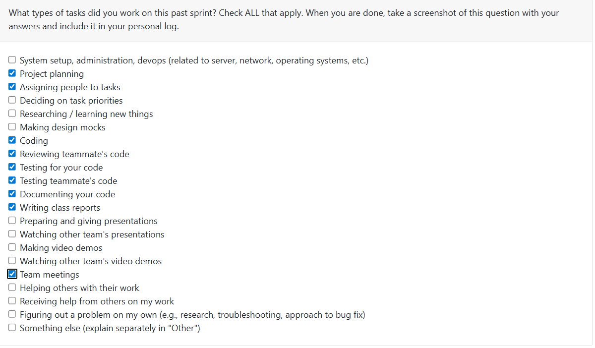

# T2Week 5: 2026/2/2 – 2026/2/8

## Tasks Worked On

---

## Weekly Goals Recap
This week, our team keep develop the milstone 2 things. We improve the frount end features and also improve the backend functions. 

---

## My Contributions
This week I am keep developing the user data isolation feature.
- [Finished] Isolation in user_preference feature.

### issue developed:
[Issue127-8: implement data isolation in user preference](https://github.com/COSC-499-W2025/capstone-project-team-9/pull/305)
This PR is for implement the user data isolation in user preference relate functions
- Update the user_preferences table which use user_name as foreign key.
- Remove redundancy codes from collaborative_storage.py as those codes already be implement in user_preferences.py.
- Update all other functions which relate to user_preference table to transfer user_name or current_user parameter.
- Update the tests in needs.
- Add a tool called 'migrate_user_preferences_to_username.py' under developTools folder to update the database in other PC.

### PR reviewed: 
1. [cli: stabilize input/output handling and add CLI tests](https://github.com/COSC-499-W2025/capstone-project-team-9/pull/303)
2. [refactor(api): standardize error responses and align tests](https://github.com/COSC-499-W2025/capstone-project-team-9/pull/304)
3. [Added function to create an account](https://github.com/COSC-499-W2025/capstone-project-team-9/pull/309)
4. [Refactor with tests](https://github.com/COSC-499-W2025/capstone-project-team-9/pull/310)

### Went well:
Finished all user data isolation problems that can be fond now.
### Not well:
No one review my PRs, so they can not be merged now.
### Next cycle:
Finish my milestone2 jobs in next week and read week.
