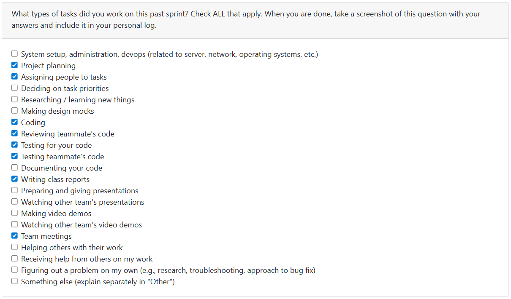

# T2Week 8: 2026/2/23 – 2026/3/1

## Tasks Worked On

---

## Weekly Goals Recap
This week, our team is finishing milestone2 things, such as finish last feature and refactor.

---

## My Contributions
This week I am developing the milestone2 features.
- [Finish] Customize and save information about a portfolio showcase project

### issue developed:
[issue209-2：implement frontend of customize and save information about a portfolio showcase project](https://github.com/COSC-499-W2025/capstone-project-team-9/pull/326)
This PR add a front end UI for customize portfolio feature based on issue209's API.

[bug-fix: the current analysis project function not work](https://github.com/COSC-499-W2025/capstone-project-team-9/pull/327)
This PR fix the BUG of analyze project feature not work on both front and back end which caused by wrong file path.
- modify the project_analyzer.py to fit the user data isolation
- modify menus.py to transfer user_name when use analyze function
- modify upload_file.py file to ensure right path when use analyze function in backend
- Update tests in need

### PR reviewed: 
1. [feat(api): add request context middleware with request-id and timing headers](https://github.com/COSC-499-W2025/capstone-project-team-9/pull/330)
2. [Refactor with hardcode constants](https://github.com/COSC-499-W2025/capstone-project-team-9/pull/332)

### Went well:
Finished my milestone2 jobs.
### Not well:
The remaining jobs are simple.
### Next cycle:
Develop milestone3 jobs.
