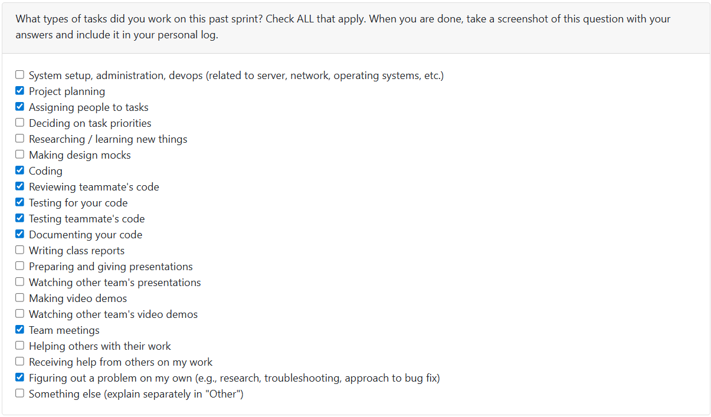

# T2Week 9: 2026/3/2 – 2026/3/8

## Tasks Worked On

---

## Weekly Goals Recap
This week, our team is focus on the milestone3 jobs.

---

## My Contributions
This week I fix the bug and improve the test coverage rate.

### issue developed:
[Bug fix: fix the front end resume generate bugs](https://github.com/COSC-499-W2025/capstone-project-team-9/pull/347)

This PR fix the frontend resume generate bugs and a login bug.

- Fix the bug report part in dashboard.html
- Enable user_name parameter transfer in backend, this let resume generate functions could get the projects
- Modify the parameter transfer let it more format
- Enable frontend resume generate works
- modify the login check to avoid jump back to the login page when login success
- Update tests in need

[Bug Fix: let the resume generate feature re well work](https://github.com/COSC-499-W2025/capstone-project-team-9/pull/349)

This PR fix the bug of generate resume, now the resume generate feature can runs well.

- The resume generate not work bug is cause by duplicate function 'get_project_by_id' in project_manager.py
- Remove the get_project_by_id function which located after line 327, and modify the left one.
- Update the other functions that call get_project_by_id to fit the new return data structure
- Update the tests in need

[Update test_local_analyzer.py](https://github.com/COSC-499-W2025/capstone-project-team-9/pull/351)

This PR increase the test coverage of local_analyzer.py from 55% to 93%

### PR reviewed: 
1. [Add additional tests for project API routes to improve coverage](https://github.com/COSC-499-W2025/capstone-project-team-9/pull/350)
2. [Implement Global Exception Handling](https://github.com/COSC-499-W2025/capstone-project-team-9/pull/342)
3. [Frontend Design + Logic Fixes](https://github.com/COSC-499-W2025/capstone-project-team-9/pull/345)

### Went well:
Found out and fix a bussiness bug that never be mentioned.
### Not well:
There even exist core bussiness bug in the system.
### Next cycle:
Develop milestone3 jobs.
