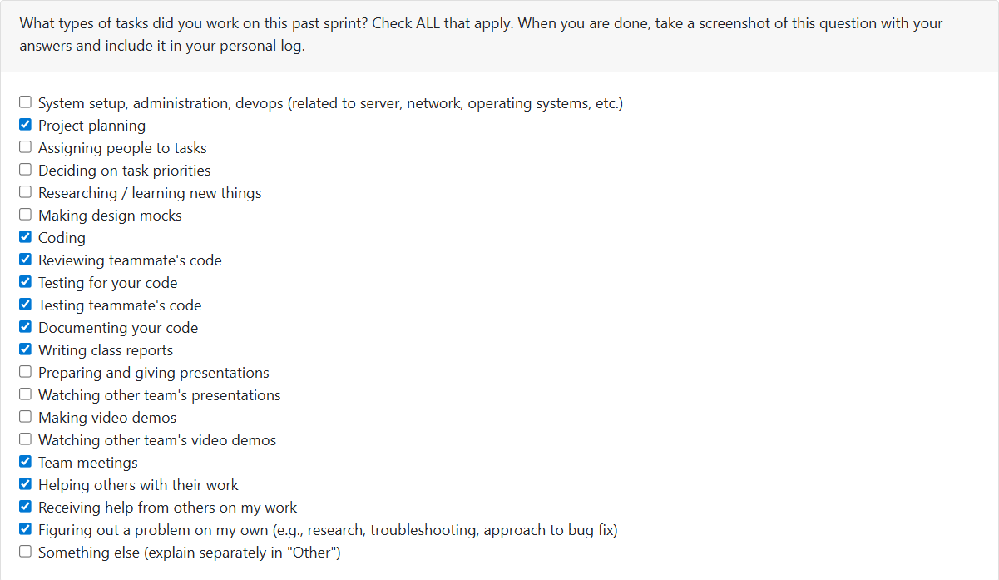

# Week 12: 2025/11/17 – 2025/11/23

## Tasks Worked On

---

## Weekly Goals Recap
This week, our team is main focus on code feractoring/bug fixing, develop the resume system and account system.
Focus on expanding user-facing features, strengthening backend robustness, and integrating deep analysis into higher-level workflows such as project ranking and portfolio construction.

---

## My Contributions
This week I focus on Back-end accouont system development and code review.

I fix the problems in PR [issue#132: develop basic login and logout feature](https://github.com/COSC-499-W2025/capstone-project-team-9/issues/132) 
- Add 
-  

### issue developed:

[issue#132: develop basic login and logout feature](https://github.com/COSC-499-W2025/capstone-project-team-9/pull/138)
- Developed user_manager.py file, which use a class to manage and do all account operations, currently has loging, logout and registration.
- At the same time, user_manager.py file could also store the current login account information locally.
- Developed user_menus.py file and modify the main_menus.py to  add an user menus to the system, which displays the current user and allows users to log in, log out, and register an account.
- This user menus would be extened as future more account system's functions be developed.
- The issue 132 current effect the menus and user data table only, the account system has not yet been linked with other systems.

### PR reviewed: 
1. [Deep Code Analysis (PUSH FIRST) #134](https://github.com/COSC-499-W2025/capstone-project-team-9/pull/134)
2. [Deep Analysis Implementation (PUSH SECOND) #135](https://github.com/COSC-499-W2025/capstone-project-team-9/pull/135)
3. [Be able to edit ranks and data of ranking](https://github.com/COSC-499-W2025/capstone-project-team-9/pull/137)

### Went well:
Developed basic logics of account system well.
### Not well:
Not provide sufficiently detailed code suggestions to the PRs I reviewed.
### Next cycle:
Push the development of the account system such as connect user table with other tables and be sure it wont break the whole project.
