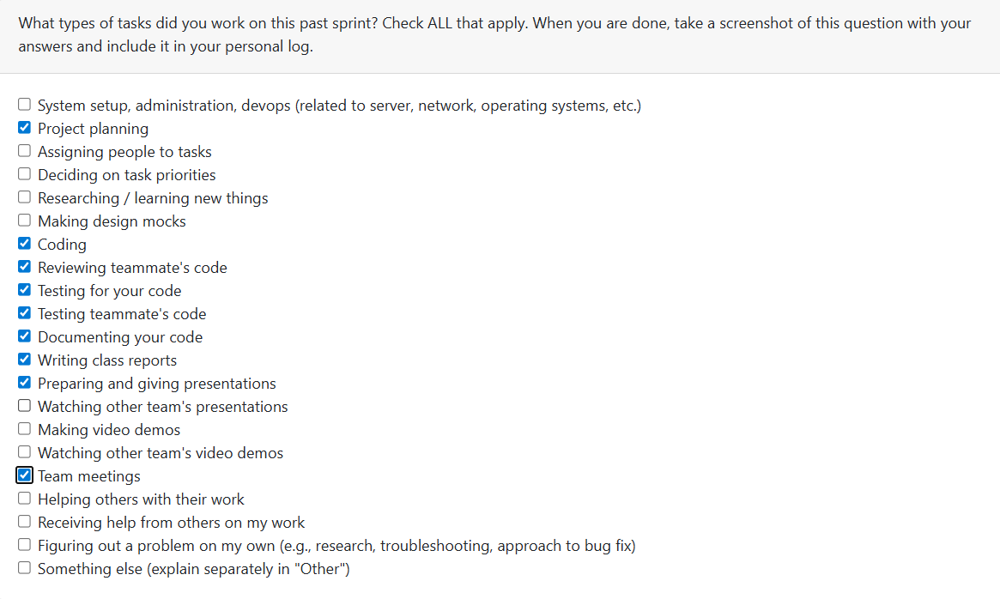

# Week 13: 2025/11/24 – 2025/11/30

## Tasks Worked On

---

## Weekly Goals Recap
This week, our team is main focus on code feractoring existing codes, add more test to cover more tests, build up milestone1 presentation power point, and prepare for presentation.

---

## My Contributions
This week I focus on refactoring of account system, add test to increas the test coverage on account system and review codes.
- refactoring the code on menu showing part in user_menus.py.
- Add more test to increase the test coverage on user_menus.py. 

### issue developed:

Refactoring: [Refactoring of user menus](https://github.com/COSC-499-W2025/capstone-project-team-9/pull/161)
- use constant to store login and account management menu's options. Not direct use print to show options.
- user selections are now catch by the handlers instead of if-else
- This change would making it easier to add new features in the future

Test add: [Add more test for user_menus.py to extend the test coverage of this file.](https://github.com/COSC-499-W2025/capstone-project-team-9/pull/167)
- Improve test coverage of user_menus.py form 69% to 82%
- Add more test for EOF Handling
- Add more test for edge cases
- Add more test for cross plateform

### PR reviewed: 
1. [test_key_metrics.py update](https://github.com/COSC-499-W2025/capstone-project-team-9/pull/156)
2. [Refactor main menu to use list-based rendering and dispatch map](https://github.com/COSC-499-W2025/capstone-project-team-9/pull/159)
3. [Database Connection Refactor](https://github.com/COSC-499-W2025/capstone-project-team-9/pull/160)
4. [Refactoring resume feature](https://github.com/COSC-499-W2025/capstone-project-team-9/pull/162)
5. [Write tests for resume creation](https://github.com/COSC-499-W2025/capstone-project-team-9/pull/164)
6. [Fixed Testing for ranking storage and improved coverage](https://github.com/COSC-499-W2025/capstone-project-team-9/pull/166)

### Went well:
Refactoring the code successfully and the new test could be run on linx system.
### Not well:
Not develop any new feature or fix bugs, but due to the system is already ready for milestone1 so it is not a big problem.
### Next cycle:
Push the development of the account system, such as implement the user data isolation feature. And try to push milestone2 stuffs.

