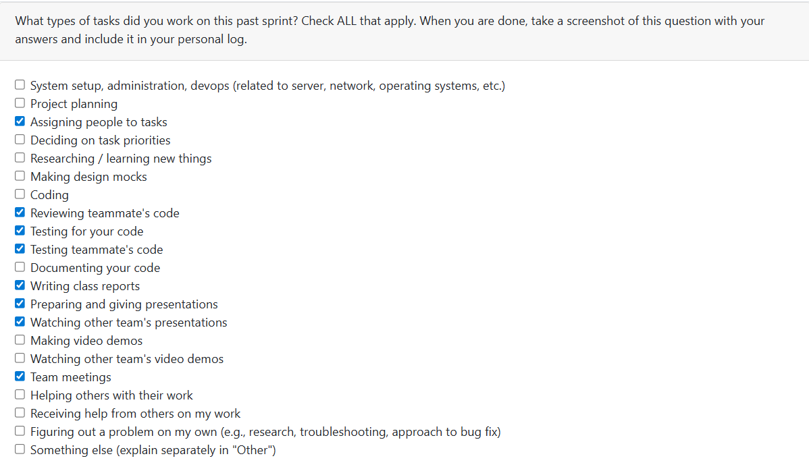

# Week 14: 2025/12/1 – 2025/12/7

## Tasks Worked On

---

## Weekly Goals Recap
This week, our team is main focus on code feractoring existing codes, add more test to cover more tests.

---

## My Contributions
This week I add test to increas the test coverage on account system and review codes.
- Add a new file called test_consent_disply.py to increase test coverage for consent.py and consent_display.py

### issue developed:
Test add: [Add test for consent and consent display.](https://github.com/COSC-499-W2025/capstone-project-team-9/pull/173)
- Increase test coverage form 32% to 99%
- test for output structure
- test for different user input
- test for EOF and different valid/invalid user input
- test for Exception handling
- test for user interaction

### PR reviewed: 
1. [Add full test coverage for external service permissions and collaborative decorator](https://github.com/COSC-499-W2025/capstone-project-team-9/pull/170)
2. [Update test_collaborative.py](https://github.com/COSC-499-W2025/capstone-project-team-9/pull/171)
3. [Added more testing for the resume formatter to ensure that there is 1…](https://github.com/COSC-499-W2025/capstone-project-team-9/pull/172)
4. [Add tests for service config](https://github.com/COSC-499-W2025/capstone-project-team-9/pull/181)

### Went well:
Review many PRs and new test do not cause paltform problem.
### Not well:
Not develop any new feature or fix bugs, but due to the system is already ready for milestone1 so it is not a big problem.
### Next cycle:
Push to finish the account system's development, and find out what should I do for milestone2.
