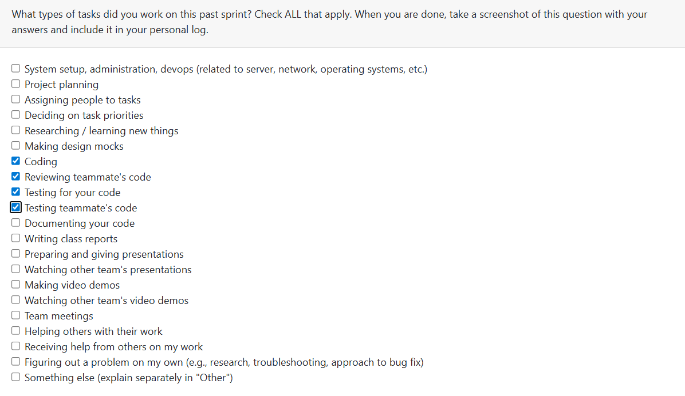

# Week 15: 2026/1/5 – 2026/1/11

## Tasks Worked On

---

## Weekly Goals Recap
This week, our team is main focus on code feractoring existing codes, add more test.

---

## My Contributions
This week I do the refactoring on upload file functions and the upload_file data table.
- Change the codes in upload_file.py to fit the existed account system, and change test_upload_file.py to test the new codes.

### issue developed:
Refactoring: [issue128 refactoring associate newly uploaded files with the user](https://github.com/COSC-499-W2025/capstone-project-team-9/pull/184)
- refactoring on the file uploaded codes and uploaded_file DB.
- Add user_name form user_information table as the foreign key to uploaded_file table
- Modify file upload codes to make the system can upload current user's user_name to the uploaded_file table
- update the tests of uploaded file

### PR reviewed: 
1. [Added tests and fixed all tests for prev PR PUSH BEFORE FIRST PR](https://github.com/COSC-499-W2025/capstone-project-team-9/pull/183)
2. [Changing the Resume format](https://github.com/COSC-499-W2025/capstone-project-team-9/pull/182)

### Went well:
Pushed refactoring on old codes, so that the account can play a practical role.
### Not well:
As not all people arrive school this week, we did not have a clear goal on what we should do this week.
### Next cycle:
Finish the refactoring on old codes, and push the development on milestone 2.
