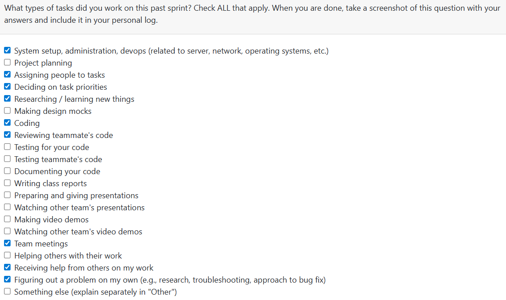

# Week 6: 2025/10/06 – 2025/10/12

## Tasks Worked On

---

## Weekly Goals Recap
This week, our team primarily focused on setting up the project environment for future development.  
Key setup tasks included configuring **Docker**, **Git Bash**, **VS Code**, and other essential tools required for backend service development.

---

## My Contributions
I took responsibility for one of the main features from **Milestone #1**:  
### [Issue #7 – Parse Upload Folder](https://github.com/COSC-499-W2025/capstone-project-team-9/issues/7#issue-3496337875)

It consists of the following three sub-issues:

1. [Store Extracted Data](https://github.com/COSC-499-W2025/capstone-project-team-9/issues/33)  
   → Implemented logic to store parsed data for further analysis.

2. [Skip All Folders Ending with “/”](https://github.com/COSC-499-W2025/capstone-project-team-9/issues/34)  
   → Improved parsing accuracy by excluding unnecessary directory entries.

3. [List All Files and Folders in Nested Order](https://github.com/COSC-499-W2025/capstone-project-team-9/issues/35)  
   → Developed recursive traversal to ensure correct hierarchical structure when listing files.

This feature is a **core component** of our system, as it allows the backend to read data from a user-specified folder and prepare it for further analysis and visualization.
