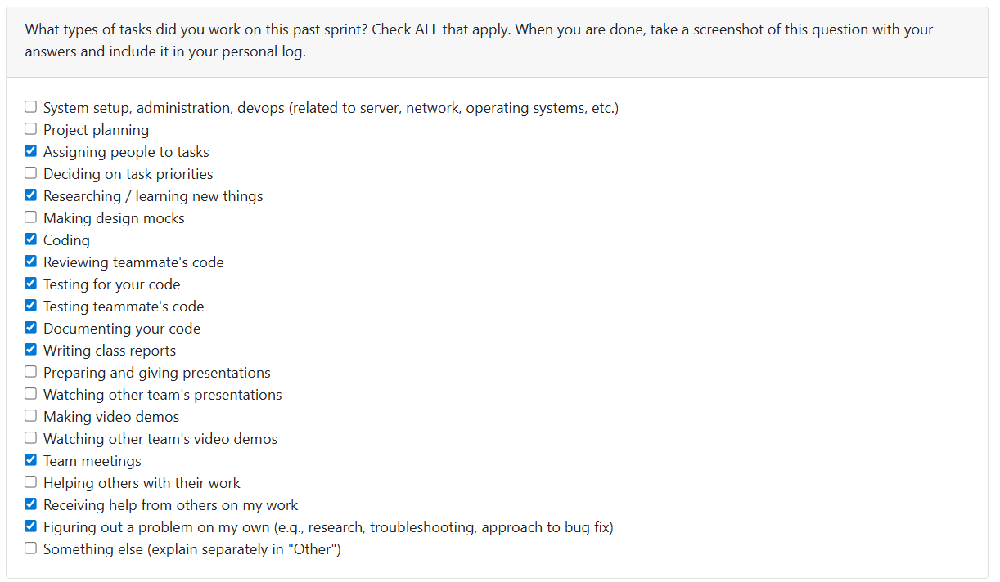

# Week 7: 2025/10/13 – 2025/10/19

## Tasks Worked On

---

## Weekly Goals Recap
This week, our team focus on pushing the project backend development.
Main focus on the database connection and file read/store features.

---

## My Contributions

I develop subissue of this feature:
### [Issue #7 – Parse Upload Folder](https://github.com/COSC-499-W2025/capstone-project-team-9/issues/7#issue-3496337875)
1. [Store Extracted Data](https://github.com/COSC-499-W2025/capstone-project-team-9/issues/33)
PR: [Store Extracted Data #33 #73](https://github.com/COSC-499-W2025/capstone-project-team-9/pull/73)

2. [Skip All Folders Ending with “/”](https://github.com/COSC-499-W2025/capstone-project-team-9/issues/34)   
PR: [Skip all folders then end with "/" #34 #66](https://github.com/COSC-499-W2025/capstone-project-team-9/pull/66)

At the same time, I also review following PRs:
1. [Implement conditional logic for external service routing #69](https://github.com/COSC-499-W2025/capstone-project-team-9/pull/69)
2. [Bug fix: File_lister incorect ordering #68](https://github.com/COSC-499-W2025/capstone-project-team-9/pull/68)
