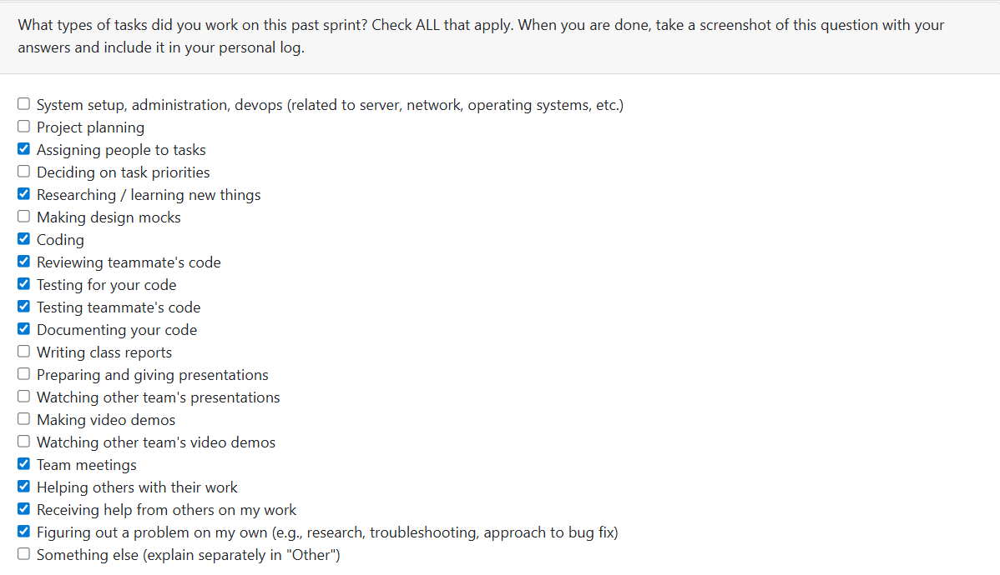

# Week 8: 2025/10/20 – 2025/10/26

## Tasks Worked On

---

## Weekly Goals Recap
This week, our team focus on pushing the project backend development.

---

## My Contributions
This week I focus on Back-end information display function development and code review.

Update and part overwrite the file upload function to implement better feedback when user upload files.
- Use a new class called **UploadResult** to store the upload results
- Modify the codes in **upload_file.py** so that all functions can use a object of **UploadResult** to store status of uploading process and return it back to main.py when upload success or failure.
- Modify the codes in **main.py**, so thant it can show print the **UploadResult** out.
- Add test functions for bothe modify in **upload_file.py** and **main.py**.
**Requirements addressed:**
- issue 29 - Display error message on the UI, Inform the user of the error type

### issur developed:
1. [Display error message on the UI, Inform the user of the error type #29](https://github.com/COSC-499-W2025/capstone-project-team-9/issues/29)

PR: [Display error message on the UI, Inform the user of the error type #29](https://github.com/COSC-499-W2025/capstone-project-team-9/pull/79)

The main purpose of this issue is to allow users to better understand the situation by displaying detailed information on whether the file upload is successful or not on the current UI interface.
I implement this feature by adding class to store feedback information from each file upload operation, allowing users to more directly understand whether the file upload was successful or any errors.
I also rewrote some of the codes in main.py and upload_file.py to accommodate this change.

### PR reviewed: 
1. [Be able to identify the activity type and the amount of contribution #75](https://github.com/COSC-499-W2025/capstone-project-team-9/pull/75)
2. [Be able to identify the activity type and the amount of contribution #83](https://github.com/COSC-499-W2025/capstone-project-team-9/pull/83)
3. [internal analysis #78](https://github.com/COSC-499-W2025/capstone-project-team-9/pull/78)
