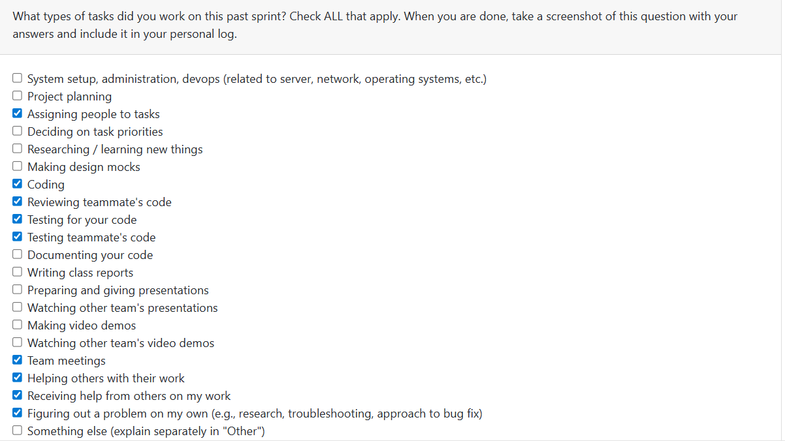

# Week 9: 2025/10/27 – 2025/11/2

## Tasks Worked On

---

## Weekly Goals Recap
This week, our team focus on refectoring and bug fix.

---

## My Contributions
This week I focus on Back-end code bug fix and code review.

Fixed a bug in my code from last week that prevented the system from uploading files and saving files to the database. Check others' PR to make sure no problems in them.

### bug fixed:

[Fixed a spelling error and optimized the closing of sursor and conn. #97](https://github.com/COSC-499-W2025/capstone-project-team-9/pull/97)

This bug cause prevented the system from uploading files and saving files to the database. 
The issue was resolved by accidentally deleting the original code that saved files while modifying the upload_file.py file and then adding it back.
This means that future code modifications will require running the main program for testing.

### PR reviewed: 
1. [fixing routing problems of test_activity_classifier.py #96](https://github.com/COSC-499-W2025/capstone-project-team-9/pull/96)
2. [Ranking projects #98](https://github.com/COSC-499-W2025/capstone-project-team-9/pull/98)
3. [Refactoring PR #1 #100](https://github.com/COSC-499-W2025/capstone-project-team-9/pull/100)
4. [Refactoring PR #2 #101](https://github.com/COSC-499-W2025/capstone-project-team-9/pull/101)
5. [Issue #10, Analysis if User Declines Outside Sources #102](https://github.com/COSC-499-W2025/capstone-project-team-9/pull/102)
6. [Clean Up Old Insights by Project ID (Issue#87) #95](https://github.com/COSC-499-W2025/capstone-project-team-9/pull/95)

### Went well:
Fix the old bug that I didn't found out in last week, and review many group member's code. These works could help to avoid more bugs.
### Not well:
Have no time to develop features, this may slow down project development.
