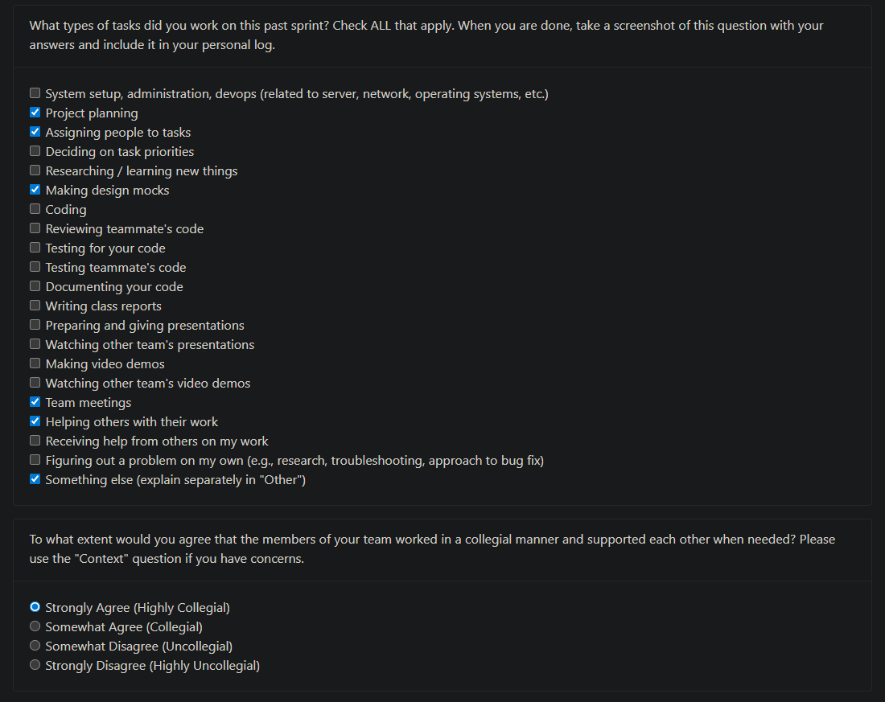

## **Eric Weekly Log**

### **Week 5: September 29th – October 5th**

**Tasks worked on:**

**Weekly Goals Recap**

This week, our team focused on creating **Data Flow Diagrams (DFD)** for both **Level 0 and Level 1** to represent our system’s data movement and process interactions.  
I worked primarily with **Jinxi** and **Kevin** to design the **Level 0 diagram**, ensuring that the main processes, data stores, and external entities were clearly defined and logically connected.  

Through team meetings and discussions, we refined the diagram’s structure and confirmed that the data flow aligned with our earlier system architecture and requirements.  
We also supported teammates who were working on Level 1 detailing, maintaining strong communication and collaboration throughout the process.
