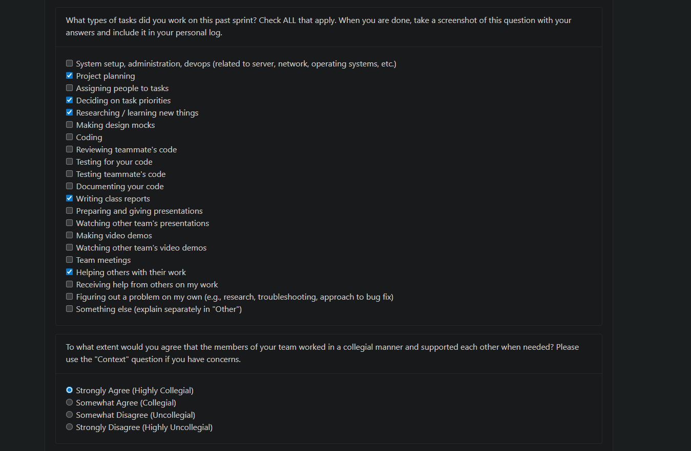
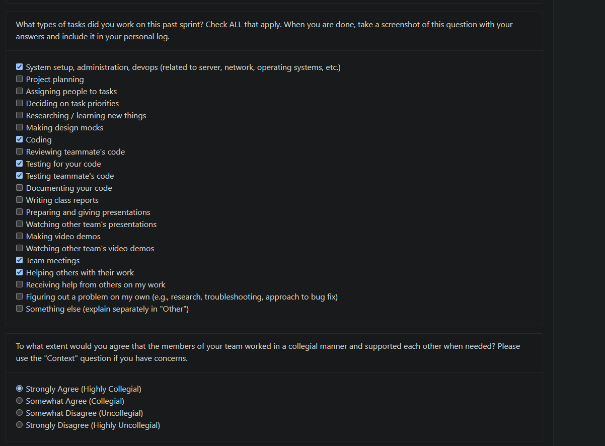
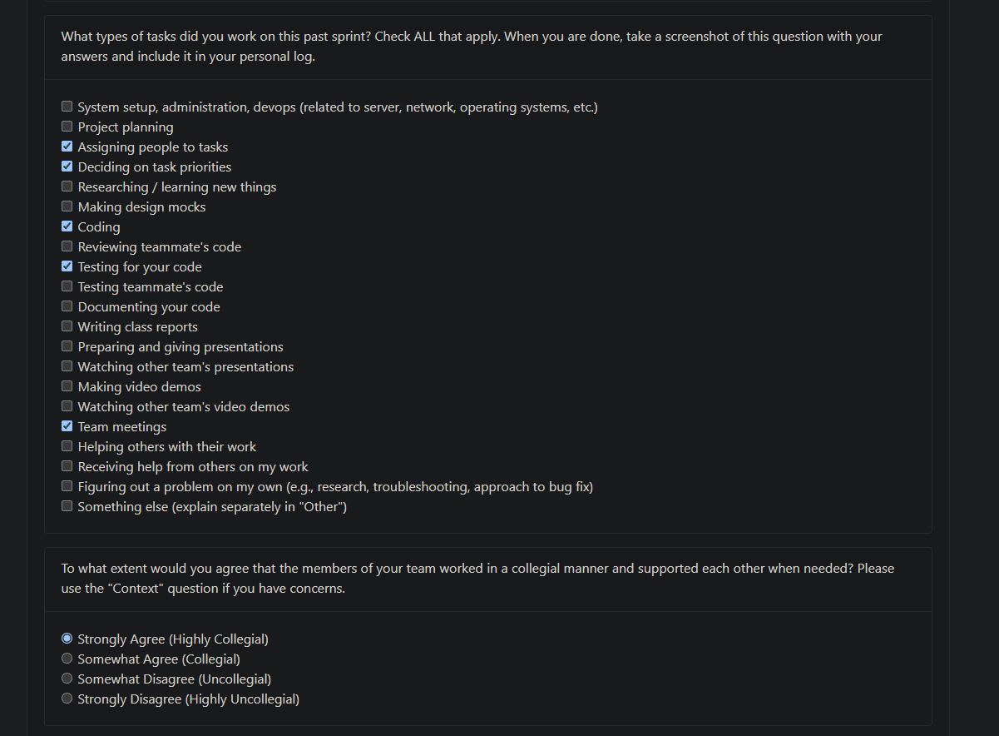
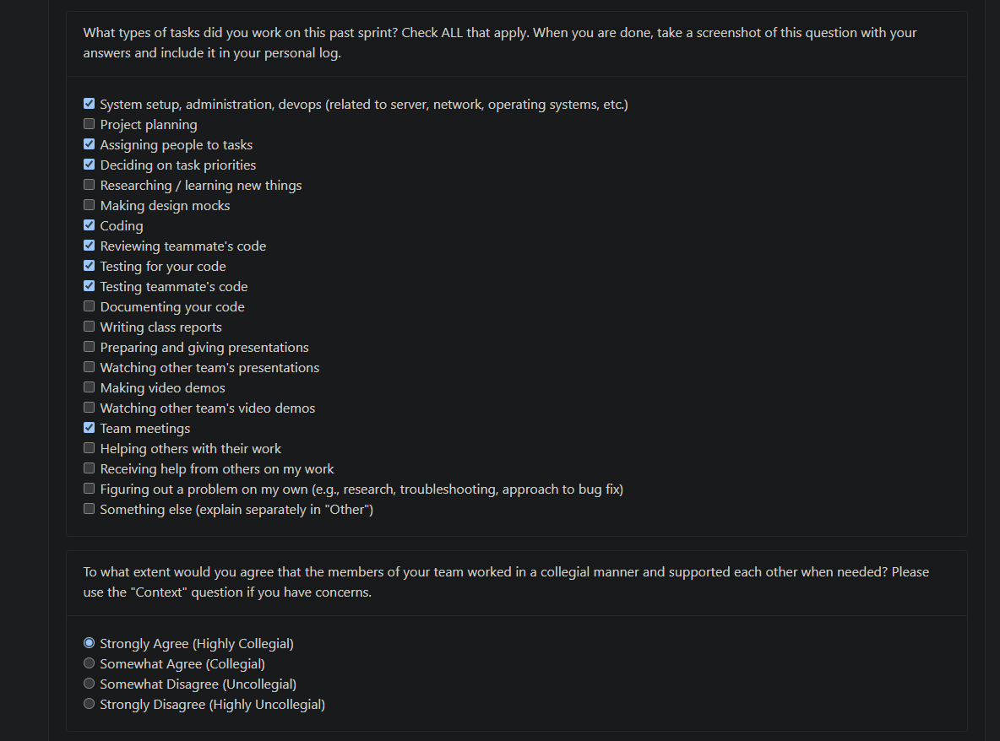

## **Eric Weekly Log**

### **Week 3: September 14th – September 21st**

**Tasks worked on:**

**Weekly Goals Recap**

This week, our team created a first draft of the **functional and non-functional requirements** for our project.  
We discussed and refined ideas about what our system should accomplish and how it should behave under different conditions.  
Afterwards, we exchanged ideas with other groups during class discussions, which helped us **clarify key requirements** and **expand our understanding** of the project’s overall scope.

I participated in defining the requirements for the backend process and helped the team write clearer descriptions for user interactions.

---

### **Week 4: September 22nd – September 28th**

**Tasks worked on:**

**Weekly Goals Recap**

This week, our team focused on producing a **System Architecture Diagram** that represented the high-level structure of our project.  
We collaborated to identify the major components and their relationships, then presented our initial version for peer feedback.

Using the feedback received, we refined our architecture to improve **data flow clarity** and **system modularity**.  
I also helped draft part of the **project proposal document**, describing the **system scope**, **key features**, and **test case planning**.

---

### **Week 5: September 29th – October 5th**

**Tasks worked on:**

**Weekly Goals Recap**

This week, our team developed **Data Flow Diagrams (DFD)** for **Level 0** and **Level 1** to better illustrate how information moves through our system.  
I worked mainly with **Jinxi** and **Kevin** to design the **Level 0 DFD**, ensuring that the main processes, data stores, and external entities were clearly and logically connected.

---

### **Week 6: October 6th – October 11th**

**Tasks worked on:**

**Weekly Goals Recap**

This week, we officially transitioned from planning to **implementation**.  
Our first task was to **set up the development environment**, which included configuring **Docker**, **Git Bash**, **VS Code**, and other essential tools required for our backend service development.

I also took responsibility for implementing two issues from **Milestone #1**:

- 🥇 **Issue #23 — “Define what is a Wrong Format and identify all valid file forms”**  
  - Implemented logic to check whether uploaded files are in `.zip` format.  
  - If a file with the wrong format is uploaded, the system now throws a custom exception `WrongFormatError`.  
  - This fulfills the milestone requirement: *“Return an error if the uploaded file is in the wrong format.”*

- 🥈 **Issue #37 — “Store users consent in Database”**  
  - Implemented a database storage mechanism to save the user’s consent choice when they first run the program.  
  - This completes the *“Store user configurations”* and *“Require user consent”* features in our design.

These tasks were an important step toward integrating **file validation** and **user configuration storage** into the system’s backend, and they helped ensure that our foundation is solid for future feature development.

---

### **Week 7: October 12th – October 17th**

**Tasks worked on:**  

**Weekly Goals Recap**

This week, I continued working on backend feature development and focused on improving **data management** and **user preference handling**. The main goal was to make the system more **dynamic**, **user-centric**, and capable of handling real-time updates.

I worked on the following two issues from **Milestone #1**:

- 🥇 **Issue #54 — “Allow the user to upload files into a database so that these can be parsed”**  
  - Implemented the backend functionality that allows users to upload `.zip` project files directly into the database.  
  - Added logic to process and prepare uploaded files for future analysis, ensuring the data pipeline can start right after consent is granted.  
  - This was a major step in enabling the system to collect and analyze real user project data.

- 🥈 **Issue #40 — “Ensure database is continually updated with the user’s preferences”**  
  - Implemented a **`user_preferences`** table and corresponding functions to store and update user consent and settings dynamically.  
  - Designed automatic preference checks so the system can adapt if a user changes their consent choice later.  
  - This makes the backend more flexible and ensures user decisions are always respected in real time.

These two tasks significantly improved the overall **data flow** and **user experience**. With file upload now fully supported and preferences automatically updated, the backend is much closer to production-ready behavior and better aligned with the project’s long-term goals.
Our team continued to work in a **highly collegial** manner — supporting each other through code reviews, bug troubleshooting, and regular communication — which greatly improved our development efficiency.

---

### **Week 8: October 19th – October 25th**

**Tasks worked on:**

**Weekly Goals Recap**

This week, I continued contributing to the **backend feature development** phase, focusing on **data processing and contribution tracking**.  
Specifically, I completed two issues that are part of the **project analytics module**:

- 🥇 **Issue #49 — “Identify activity type and amount of contribution made by the user”**  
  - Implemented logic to classify user actions (e.g., commits, merges, file uploads) and quantify their contribution.  
  - Integrated backend processing to automatically recognize and record different types of user activities within the database.  
  - This lays the groundwork for generating contribution analytics in future sprints.

- 🥈 **Issue #50 — “[Rank Projects] Store the amount of work a user has contributed to a project”**  
  - Developed a feature to calculate and persist each user’s contribution score to individual projects.  
  - This allows the system to **rank projects and users** based on activity and contribution level, providing the foundation for future visualization and reporting.

This week involved both **coding and testing**, ensuring the new contribution-tracking mechanisms worked as expected.  
Our team continued to collaborate effectively through regular discussions and reviews, keeping progress smooth and well-coordinated.

---

