## **Eric Weekly Log**

### **Week 3: September 14th – September 21st**

**Tasks worked on:**

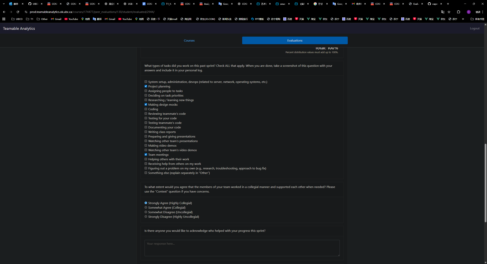

**Weekly Goals Recap**

This week, our team created a first draft of the **functional and non-functional requirements** for our project.  
We discussed and refined ideas about what our system should accomplish and how it should behave under different conditions.  
Afterwards, we exchanged ideas with other groups during class discussions, which helped us **clarify key requirements** and **expand our understanding** of the project’s overall scope.

I participated in defining the requirements for the backend process and helped the team write clearer descriptions for user interactions.

---

### **Week 4: September 22nd – September 28th**

**Tasks worked on:**

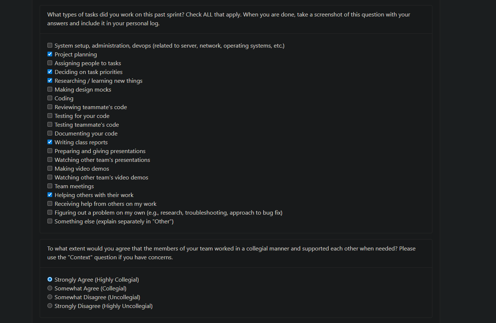

**Weekly Goals Recap**

This week, our team focused on producing a **System Architecture Diagram** that represented the high-level structure of our project.  
We collaborated to identify the major components and their relationships, then presented our initial version for peer feedback.

Using the feedback received, we refined our architecture to improve **data flow clarity** and **system modularity**.  
I also helped draft part of the **project proposal document**, describing the **system scope**, **key features**, and **test case planning**.

---

### **Week 5: September 29th – October 5th**

**Tasks worked on:**

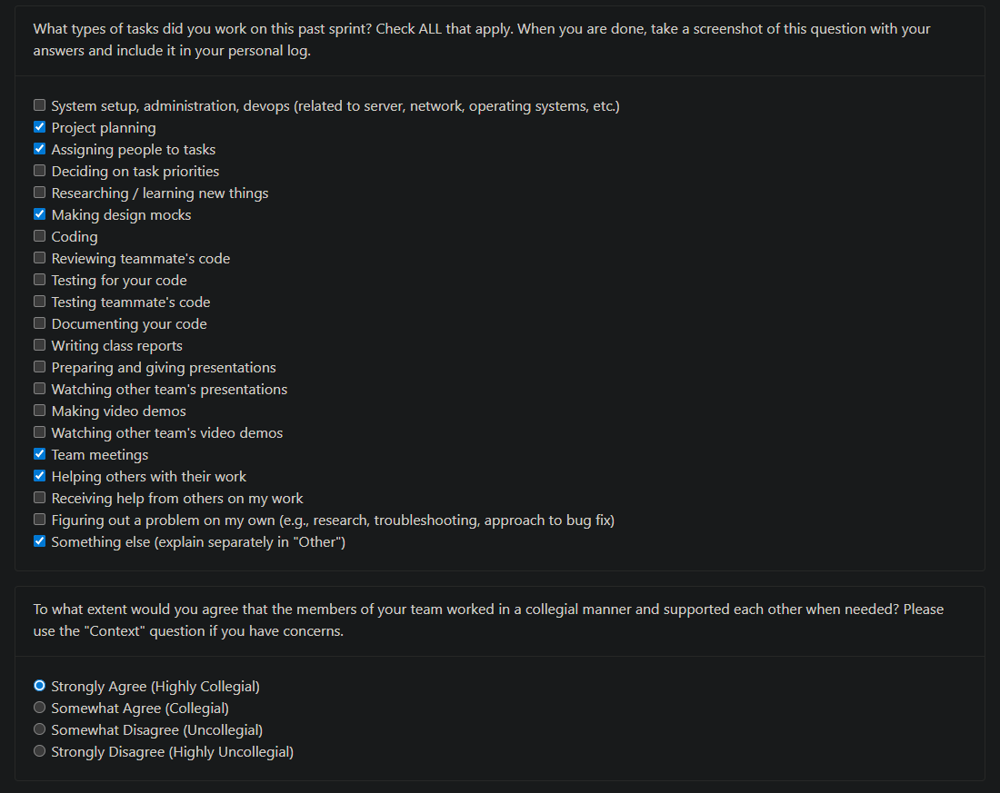

**Weekly Goals Recap**

This week, our team developed **Data Flow Diagrams (DFD)** for **Level 0** and **Level 1** to better illustrate how information moves through our system.  
I worked mainly with **Jinxi** and **Kevin** to design the **Level 0 DFD**, ensuring that the main processes, data stores, and external entities were clearly and logically connected.

---

### **Week 6: October 6th – October 11th**

**Tasks worked on:**

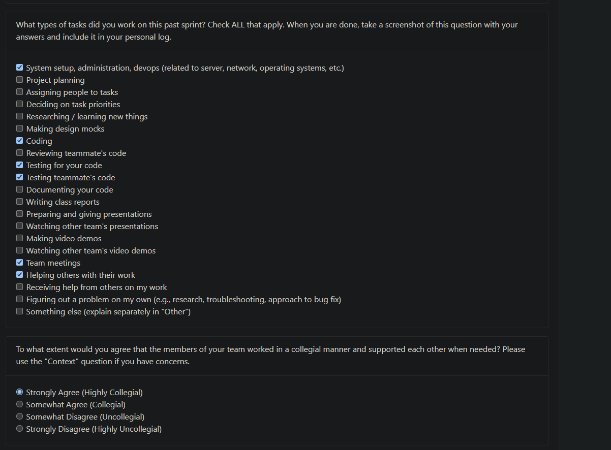

**Weekly Goals Recap**

This week, we officially transitioned from planning to **implementation**.  
Our first task was to **set up the development environment**, which included configuring **Docker**, **Git Bash**, **VS Code**, and other essential tools required for our backend service development.

I also took responsibility for implementing two issues from **Milestone #1**:

- 🥇 **Issue #23 — “Define what is a Wrong Format and identify all valid file forms”**  
  - Implemented logic to check whether uploaded files are in `.zip` format.  
  - If a file with the wrong format is uploaded, the system now throws a custom exception `WrongFormatError`.  
  - This fulfills the milestone requirement: *“Return an error if the uploaded file is in the wrong format.”*

- 🥈 **Issue #37 — “Store users consent in Database”**  
  - Implemented a database storage mechanism to save the user’s consent choice when they first run the program.  
  - This completes the *“Store user configurations”* and *“Require user consent”* features in our design.

These tasks were an important step toward integrating **file validation** and **user configuration storage** into the system’s backend, and they helped ensure that our foundation is solid for future feature development.

---

### **Week 7: October 12th – October 17th**

**Tasks worked on:**  

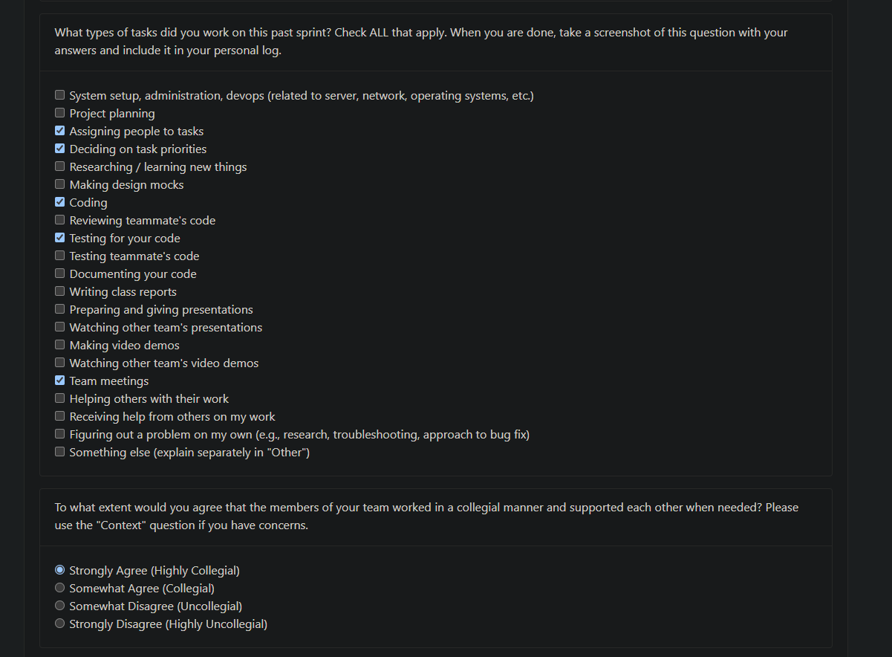

**Weekly Goals Recap**

This week, I continued working on backend feature development and focused on improving **data management** and **user preference handling**. The main goal was to make the system more **dynamic**, **user-centric**, and capable of handling real-time updates.

I worked on the following two issues from **Milestone #1**:

- 🥇 **Issue #54 — “Allow the user to upload files into a database so that these can be parsed”**  
  - Implemented the backend functionality that allows users to upload `.zip` project files directly into the database.  
  - Added logic to process and prepare uploaded files for future analysis, ensuring the data pipeline can start right after consent is granted.  
  - This was a major step in enabling the system to collect and analyze real user project data.

- 🥈 **Issue #40 — “Ensure database is continually updated with the user’s preferences”**  
  - Implemented a **`user_preferences`** table and corresponding functions to store and update user consent and settings dynamically.  
  - Designed automatic preference checks so the system can adapt if a user changes their consent choice later.  
  - This makes the backend more flexible and ensures user decisions are always respected in real time.

These two tasks significantly improved the overall **data flow** and **user experience**. With file upload now fully supported and preferences automatically updated, the backend is much closer to production-ready behavior and better aligned with the project’s long-term goals.
Our team continued to work in a **highly collegial** manner — supporting each other through code reviews, bug troubleshooting, and regular communication — which greatly improved our development efficiency.

---

### **Week 8: October 19th – October 25th**

**Tasks worked on:**

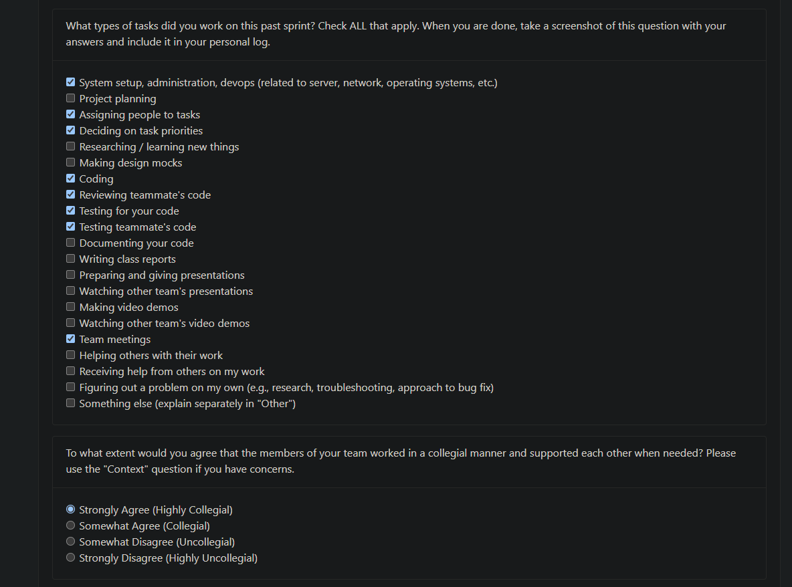

**Weekly Goals Recap**

This week, I continued contributing to the **backend feature development** phase, focusing on **data processing and contribution tracking**.  
Specifically, I completed two issues that are part of the **project analytics module**:

- 🥇 **Issue #49 — “Identify activity type and amount of contribution made by the user”**  
  - Implemented logic to classify user actions (e.g., commits, merges, file uploads) and quantify their contribution.  
  - Integrated backend processing to automatically recognize and record different types of user activities within the database.  
  - This lays the groundwork for generating contribution analytics in future sprints.

- 🥈 **Issue #50 — “[Rank Projects] Store the amount of work a user has contributed to a project”**  
  - Developed a feature to calculate and persist each user’s contribution score to individual projects.  
  - This allows the system to **rank projects and users** based on activity and contribution level, providing the foundation for future visualization and reporting.

This week involved both **coding and testing**, ensuring the new contribution-tracking mechanisms worked as expected.  
Our team continued to collaborate effectively through regular discussions and reviews, keeping progress smooth and well-coordinated.

---

### **Week 9: October 26th – November 2nd**

**Tasks worked on:**

**Weekly Goals Recap**

This week, I focused on completing Issue #87 — “Cleanup Old Insights”, an important maintenance feature for the project’s data-management module.

- 🥇 **Issue #87 — “Clean up old Insights”**  
  - Implemented a cleanup function to safely remove previously generated insight data from the database.
  - The feature now deletes both file_contents and the corresponding records in uploaded_files, ensuring that outdated or unused project data is fully cleared to free storage and prevent redundant analysis.
  - Added unit tests (test_cleanup_insights.py) using mock database connections to verify the deletion logic and row count behavior without touching real data.
  - Integrated the cleanup option into the main menu, allowing users to manually trigger data cleanup through the CLI interface with confirmation prompts.

This feature enhances the system’s maintainability and data consistency by ensuring that obsolete projects and their artifacts can be removed cleanly.
Throughout the week, I performed several rounds of testing with the team to validate database behavior and confirm compatibility with existing modules such as project summarization and analysis.

---

### **Week 10: November 2nd – November 8th**

**Tasks worked on:**

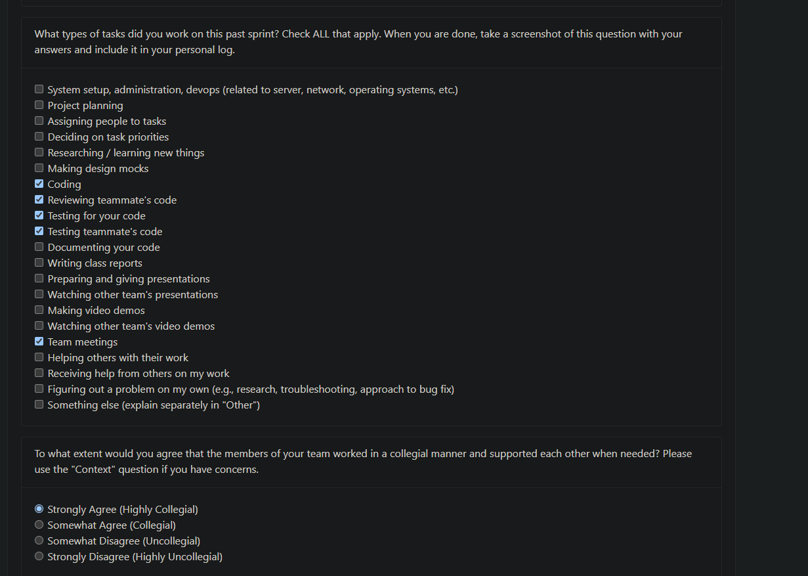

**Weekly Goals Recap**

This week, I focused on implementing **Feature #10 — Extract Key Contribution Metrics**, which is an important step toward providing meaningful project analytics for our backend system.

The main goal of this feature is to **analyze and summarize contribution activities** within a project by:
- Extracting key metrics such as **project duration**, **activity frequency**, and **type distribution** (e.g., *code vs test vs design vs documentation*).  
- Displaying the relative proportion of each contribution type to help visualize how team members engage across different aspects of development.  
- Laying the groundwork for generating analytical insights in the frontend dashboard.

To achieve this, I worked on:
- Implementing functions to **parse contribution logs** and categorize actions by activity type.  
- Calculating **time-based statistics** (e.g., number of commits per week, total duration of active contributions).  
- Integrating the data with our database schema so future visualization modules can query the metrics easily.

I also tested the implementation with several sample datasets to ensure that both **data accuracy** and **consistency** across users were preserved.  
Through team meetings and reviews, we refined the metric definitions to ensure alignment with our analytics design from previous milestones.

---

### **Week 11: November 9th – November 15th**
READING WEEK!

---

### **Week 12: November 16th – November 22nd**

**Tasks worked on:**

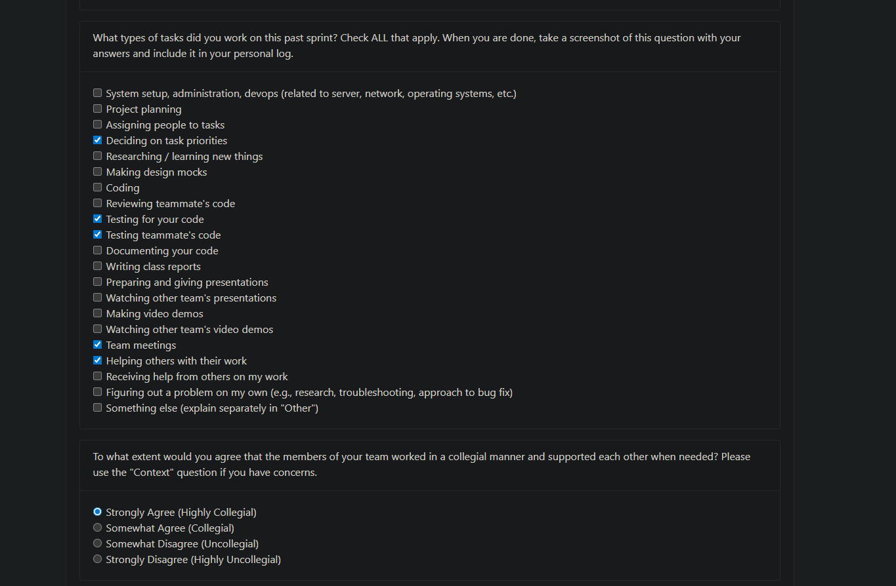

**Weekly Goals Recap**

Since Week 11 was Reading Week, development resumed this week with a focus on improving the accuracy and robustness of the project timeline and ZIP file handling logic.
I completed two key fixes that significantly improve the reliability of our analytics and upload pipeline:

---

#### **Fix #1 — Use ZIP Internal Timestamps for Accurate Project Timeline**

Previously, the project start and end dates incorrectly used the *upload time* of the ZIP file.  
This caused misleading analytics, especially for older projects or repositories worked on over multiple months.

This week, I implemented a full timestamp extraction pipeline:

- Extracted **source timestamps** from `ZipInfo.date_time` for each file.  
- Stored two new fields in `file_contents`:  
  - `source_created_at`  
  - `source_modified_at`
- Updated the key_metrics timeline logic to compute:  
  - **Project Start Date = MIN(source_created_at)**  
  - **Project End Date = MAX(source_modified_at)**  
- Added a safety fallback: if no internal timestamps exist (rare), it defaults to the timestamps in `uploaded_files`.

This fix ensures that our time-based analytics now reflect **true project history**, not the moment the ZIP was uploaded.

---

#### **Fix #2 — Robust Validation for “Fake ZIP” Files**

I also improved the upload logic to correctly detect renamed or corrupted ZIP archives.

Key improvements include:

- Added detection for **fake ZIPs** (e.g., `.rar` or `.7z` renamed to `.zip`)
- Added a clear and user-friendly `INVALID_ZIP` error message
- Added a **secondary defensive validation** using `zipfile.is_zipfile()` after the file is copied to the uploads directory
- Updated existing tests and added **two new unit tests**:
  - Validator-triggered invalid ZIP case  
  - Post-copy invalid ZIP guard case  

This prevents issues where renamed RAR files would incorrectly appear valid, and overall improves reliability and UX during file uploads.

---

### **Week 13: November 23rd – November 29th**

**Tasks worked on:**

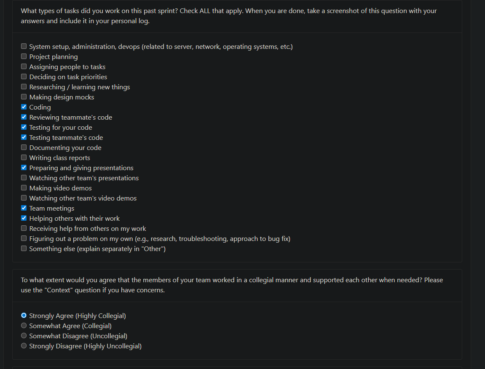

**Weekly Goals Recap**

This week focused on two major backend improvements:  
(1) refactoring the CLI menu system for cleaner structure and better maintainability, and  
(2) merging the **key_metrics** and **project_summary** features into a unified analytics workflow.

These changes streamline our user experience and simplify the internal logic of our analysis pipeline.

---

#### **Refactor: CLI Menu Structure**

The existing CLI menu had become increasingly large as more features were added (cleanup, ranking, collaborative features, user prefs, login, etc.).  
This week I refactored the menu system to make it more modular and maintainable:

- Split menu logic into **dedicated handlers** for user account, analysis, and preferences  
- Removed duplicated `input()` logic and unified all input validation  
- Cleaned up inconsistent numbering caused by the login/register option  
- Ensured the menu properly updates based on logged-in state (e.g., showing the username)  
- Improved readability of the main menu loop and reduced deeply nested logic

This refactor helps future contributors add new menu options without creating conflicts or inconsistent UX.

---

#### **Feature Merge: key_metrics + project_summary**

Previously, **key_metrics** and **project_summary** were implemented as separate flows.  
This caused:

- duplicated data extraction  
- similar logic running multiple times  
- multiple DB queries for the same information  
- confusing CLI options

This week, I merged both into a single unified analysis pipeline.

Key improvements:

- **One shared backend function** now generates both metrics and summary  
- Removed duplicated code paths and consolidated all parsing logic  
- Ensured contribution data, activity breakdown, project duration, and summary statistics all come from the **same computed dataset**  
- Updated CLI routes to provide one clear “Analyze Project” flow instead of two  
- Improved performance by reducing repeated scans over file_contents  
- Cleaned up test cases to align with the merged design

This merge sets the foundation for the future analytics dashboard and simplifies how future features (visualization, ranking, insights) will plug into the system.

---

### **Week 14: November 30th – December 6th**

**Tasks worked on:**

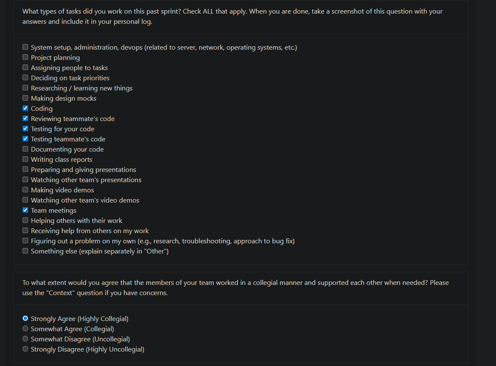

**Weekly Goals Recap**

As Milestone 1 concluded this week, my focus shifted toward improving the **reliability, stability, and overall test coverage** of our backend systems.  
This included strengthening the permission workflow, validating collaborative access control, and ensuring previously untested modules now have full coverage.  
By the end of the week, overall project test coverage increased to **~90%**, marking a major milestone in system robustness.

---

## **1. Added Full Test Suite for External Service Permission Workflow**

Several components under `external_services/` previously lacked coverage, especially those interacting with the database and user permission logic.  
This week I implemented a comprehensive test suite covering:

- `ServiceConfig.initialize_table()` (success + exception paths)
- `ServiceConfig.get_permission()` for:
  - permission=True
  - permission=False
  - no record → None
  - database failures
- `ExternalServicePermission.initialize()` with correct error handling
- `ExternalServicePermission.has_permission()` fallback logic
- Full workflow tests for `request_external_service_permission()`:
  - Skip prompting when existing permission is present
  - Execute full info → prompt → store sequence when no permission exists
  - `force=True` correctly re-prompts regardless of stored value
  - Store permission only once and with correct arguments
  - Validate printed user-facing messages

These tests greatly improve reliability of our privacy and external analysis workflows.

---

## **2. Added Tests for Collaborative Permission Decorator**

The `requires_collaborative` decorator enforces access control based on collaborative settings.  
Before this week, the file had **0% test coverage**.

I added tests to verify:

- Wrapped functions execute correctly when collaborative=True
- Execution is blocked when:
  - preferences are missing (`None`)
  - collaborative flag=False
- Correct error message is printed
- Decorator returns `None` when access is denied
- Arguments are passed correctly to wrapped functions

This brings the collaborative module to **100% coverage**, ensuring reliability for team-based features.

---

## **3. Overall Coverage & Stability Improvements**

With the new test suites added:

- Total project coverage increased from ~87% → **~90%**
- External service modules now reach **96–100% coverage**
- Collaborative decorators now reach **100% coverage**
- Several untested branches across multiple modules are now fully validated

This significantly improves long-term maintainability and helps future contributors trust the behavior of the permission systems.

---

## **Eric Weekly Log**

### **Week 1(Term 2): Jan 5th – Jan 11th**

**Tasks worked on:**

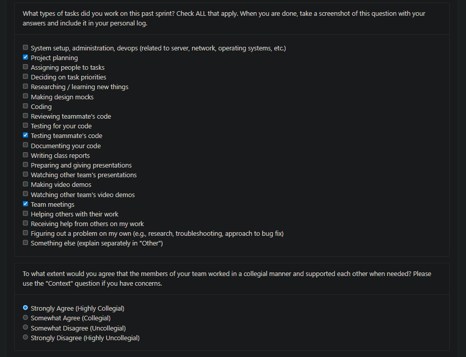

**Weekly Goals Recap**

This week I spent time reading through the Milestone 2 requirements and discussing them with the team. The focus was on understanding the scope and planning rather than writing new code. I also began considering which areas I can contribute to in the next sprint.
And I reviewed several of my teammates' codes. Will start coding next week.

---

### **Week 2 (Term 2): Jan 12th – Jan 18th**

**Tasks worked on:**

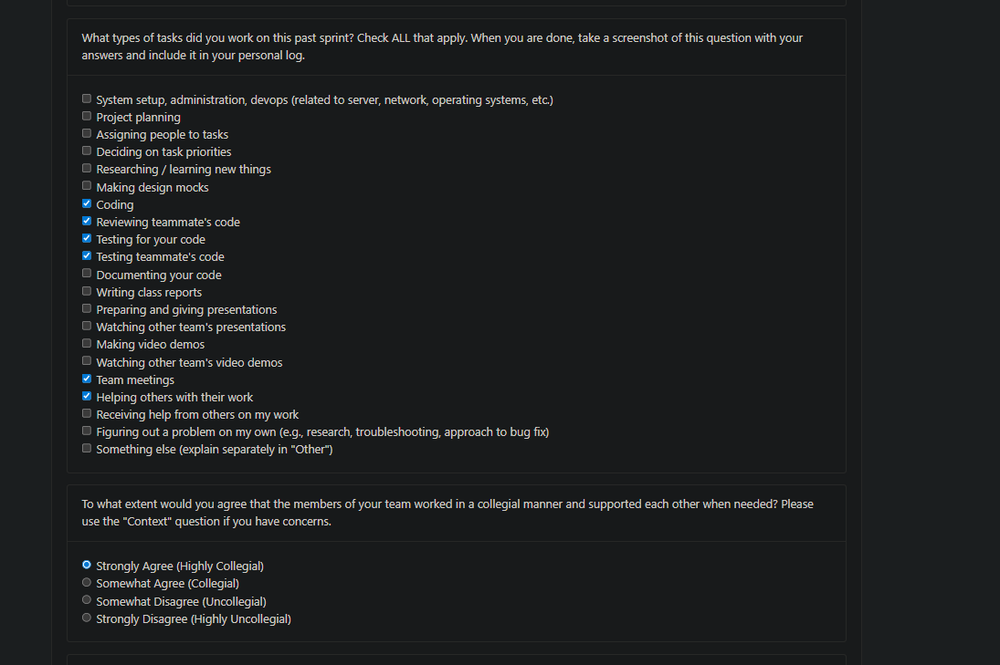

**Weekly Goals Recap**

The second week of the program required students to work on backend development tasks which supported Milestone 2 by creating a system for generating and personalizing resumes. I added features which enable users to manage their project display in their résumé through the milestone requirements and team task assignments. 

The first feature adds support for **custom résumé wording on a per-project basis**. Users can now provide their own description for an individual project, which is stored and later prioritized during résumé generation. This allows users to highlight specific contributions or achievements that may not be fully captured by automatically generated summaries, while still falling back to stored or generated summaries when no customization is provided.

The second feature extends this functionality by introducing **basic management for custom résumé wording**. Users can clear or reset previously saved custom descriptions and list which projects currently have customized wording. Together, these features define a clear lifecycle for résumé customization and make the system more robust, maintainable, and aligned with Milestone 2 requirements.

The system received its main improvement through the implementation of custom per-project wording functionality. Users have the ability to create custom résumé descriptions for particular projects which enables them to emphasize their vital work accomplishments through their own written statements instead of depending on system-generated summaries. The system produces résumés through its database search for specific wording instead of using pre-existing summaries or LLM-generated content when users do not choose their preferred customization options. The feature needs additional functionality to become operational so I implemented two features which allow users to clear their custom text and view all projects that use customized résumé descriptions. The new features establish a specific process for resume customization which enhances both functionality and user experience of the system.

I developed a specific test suite which checked the new functionality while the team worked on feature development. The testing process includes four separate tests which verify the system's ability to store custom text and remove it and display customized projects and check how the system handles user-defined text during résumé generation. I performed manual CLI testing to confirm that the entire workflow operated as users expected it to. I reviewed all pull requests from my teammates to offer feedback about their code logic and its ability to handle different situations and how well it would last in the future. The primary objective of this week required developers to build an entire feature which met all Milestone 2 requirements and improved code quality through review processes.

---

### **Week 3 (Term 2): Jan 19th – Jan 25th**

**Tasks worked on:**

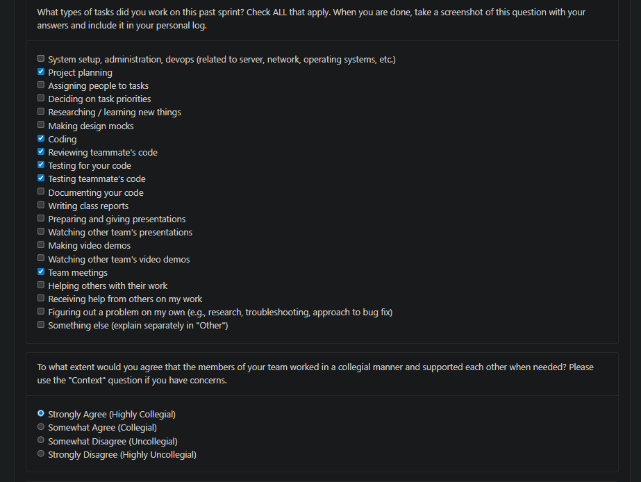

**Weekly Goals Recap**

During this week, I focused on extending the résumé generation system by enhancing how project outcomes are represented. The main goal was to incorporate evidence of success into résumé items, allowing project analysis results to be translated into concise, résumé-friendly statements that highlight measurable impact.

I implemented a dedicated evidence extraction component that derives success statements from existing project metrics, such as project scale, development duration, detected technologies, collaboration level, and quality indicators. This logic was designed as a pure, reusable module so that evidence generation remains deterministic and easy to test, without introducing additional dependencies or side effects.

The extracted evidence is now integrated into the résumé generation pipeline and displayed consistently across text, Markdown, and PDF formats. This ensures that users can clearly see how their project work translates into concrete accomplishments rather than raw metrics alone. Manual testing through the CLI confirmed that the evidence section appears correctly under each project when viewing generated résumés.

To ensure correctness and robustness, I developed a unit test suite covering the evidence extraction logic. The tests validate behavior across different scenarios, including projects with limited metadata, projects emphasizing quality signals such as tests or documentation, and cases requiring deduplication and output constraints. All tests passed locally.

In addition to feature development, I continued reviewing teammates’ pull requests and provided feedback on code structure, clarity, and maintainability. Overall, this week focused on strengthening the résumé system’s ability to communicate project value clearly while maintaining a clean and testable backend design aligned with Milestone 2 requirements.

---

### **Week 4 (Term 2): Jan 26th – Feb 1st**

**Tasks worked on:**

**Weekly Goals Recap**
This week, I focused on refactoring the CLI layer to improve maintainability, consistency, and testability without changing user-facing behavior. The work was intentionally split into two independent pull requests to keep changes scoped and easier to review.

In the first pull request, I refactored the CLI menu execution logic by introducing a shared menu runner abstraction. Previously, individual menus duplicated input loops and control flow, which made behavior inconsistent and harder to test. By centralizing menu execution logic, menus now follow a consistent structure and are easier to extend and reason about.

In the second pull request, I refactored the CLI display and output layer to standardize how success and error messages are rendered. A shared output utility was introduced to reduce duplicated formatting logic. Existing display helpers were hardened to safely handle both dictionary-based and object-based result structures, improving robustness across the CLI.

Throughout the refactor, existing behavior was preserved to remain compatible with current tests. Additional unit tests were added to validate display behavior and protect against regressions. All tests passed locally.

**GitHub Pull Requests (Evidence of Work)**

-PR1 – Refactor CLI menu execution logic:
[<<PR1 LINK>>](https://github.com/COSC-499-W2025/capstone-project-team-9/pull/271)

-PR2 – Refactor CLI display/output layer and add tests:
[<<PR2 LINK>>](https://github.com/COSC-499-W2025/capstone-project-team-9/pull/273)

**Additional Contributions**
-Reviewed teammates’ pull requests and provided feedback on code structure and test compatibility.
-Verified refactored CLI behavior through manual testing and full pytest runs.

---

### **Week 5 (Term 2): Feb 2nd – Feb 8th**

**Tasks worked on:**

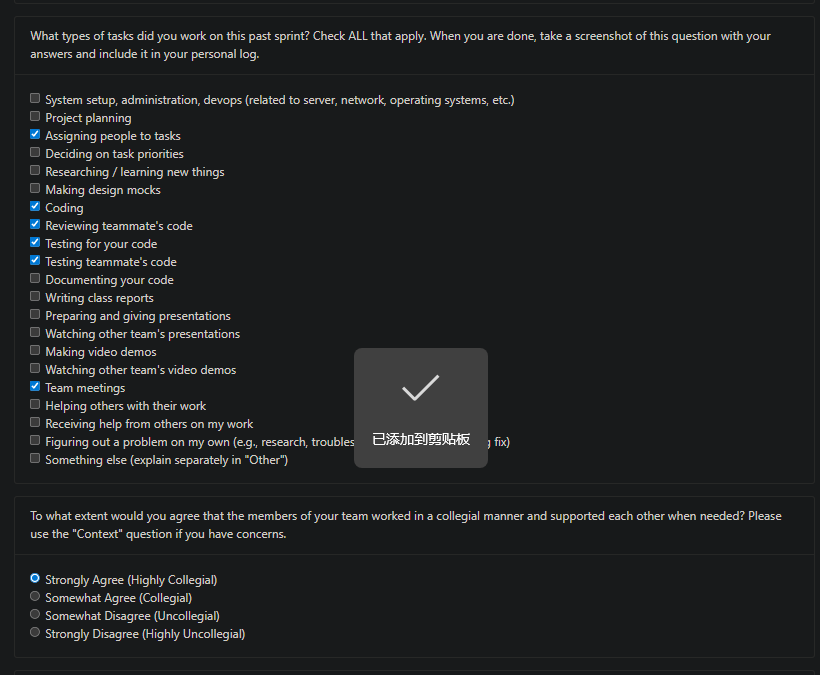

**Weekly Goals Recap**  
This week, I focused on improving the robustness and consistency of the backend API layer by standardizing error handling and aligning all related components with a clear API contract. The work was intentionally split into two independent pull requests to keep changes scoped and easier to review.

In the first pull request, I refactored API error handling across all FastAPI routes by introducing a unified error response schema. Previously, different endpoints returned errors in inconsistent formats, which made client-side handling and testing brittle. A centralized HTTP exception handler was added to ensure all API errors follow a consistent structure while preserving existing HTTP status codes.

In the second pull request, I updated the API client and refactored API endpoint tests to align with the new error contract. Tests were changed to assert against the defined response schema rather than raw framework-specific fields, effectively turning them into contract tests. This improves long-term maintainability and reduces coupling between implementation details and tests.

All changes were verified through full pytest runs, and existing behavior was preserved throughout the refactor.

**GitHub Pull Requests (Evidence of Work)**

- **PR1 – cli: stabilize input/output handling and add CLI tests#303**  
  [<<PR1 LINK>>](https://github.com/COSC-499-W2025/capstone-project-team-9/pull/303)

- **PR2 – refactor(api): standardize error responses and align tests#304**  
  [<<PR2 LINK>>](https://github.com/COSC-499-W2025/capstone-project-team-9/pull/304)

**Additional Contributions**
- Refactored API endpoint tests to validate a stable API contract rather than raw response details.
- Ensured consistent error behavior across all API routes without introducing breaking changes.
- Reviewed related backend code paths to confirm consistency and robustness.

---

### *Week 7 (Term 2): Feb 16th – Feb 22nd (Reading Week Bonus)**

**Weekly Goals Recap**  
Although this week was designated as Reading Week, I continued improving the frontend dashboard layer to enhance code quality, maintainability, and system stability without introducing new features.

The work focused on strengthening the frontend structure while ensuring compatibility with existing automated tests. Changes were intentionally scoped and validated locally to avoid unintended regressions.

In the first pull request, I refactored the dashboard frontend to standardize API calls through a unified apiRequest wrapper. Previously, some actions (upload, thumbnail addition, merge operations) performed duplicate or inconsistent network requests. This refactor eliminated redundant fetch calls and ensured consistent request handling across all user actions.

In the second pull request, I improved dashboard state restoration logic to ensure the active view and selected project are reliably restored after page reload. During this refactor, I also evaluated event handling structure and ensured compatibility with the existing frontend smoke test by preserving the inline selectProject(event, ...) handler expected by the test suite.

All changes were verified through local pytest runs, and no breaking changes were introduced.

**GitHub Pull Requests (Evidence of Work)**

- **PR1 – feat(api): add request context middleware with request-id and timing headers#330**  
  [<<PR1 LINK>>](https://github.com/COSC-499-W2025/capstone-project-team-9/pull/330)

- **PR2 – Resotre inline onclick for selectProject to satisfy existing frontend smoke test#331**  
  [<<PR2 LINK>>](https://github.com/COSC-499-W2025/capstone-project-team-9/pull/331)

**Additional Contributions**
- Removed redundant network requests to improve correctness and reduce unnecessary backend load.
- Standardized frontend API interaction patterns for better maintainability.
- Strengthened dashboard state persistence (active view + selected project restoration).
- Ensured all frontend smoke tests pass locally after refactoring.
- Maintained backward compatibility with existing test expectations.

---

### **Week 8 (Term 2): Feb 23rd – Mar 1st**
**Tasks worked on:**

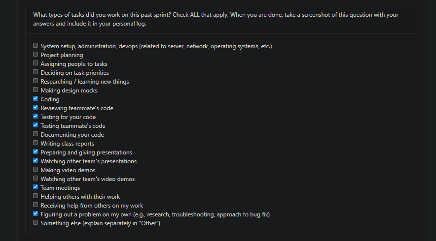

**Weekly Goals Recap**  
This week, I focused on strengthening the frontend layer of the system by improving reliability, accessibility, and request handling consistency without introducing new features.

The work was intentionally separated into two independent pull requests to maintain clear scope boundaries and reduce review complexity. All changes were scoped carefully and validated locally to avoid unintended regressions.

In the first pull request, I refactored the dashboard frontend to standardize API interaction patterns and eliminate unsafe response handling. Previously, some functions relied on inconsistent response structures and direct response.ok checks outside centralized request logic. I introduced a unified request wrapper and refactored dependent logic to use structured return values. I also reduced duplicated UI rendering logic by extracting reusable helper functions.

In the second pull request, I improved the authentication page (index.html) by enhancing accessibility and hardening request handling. I added ARIA live regions for login and registration feedback messages and refined username input behavior to prevent unintended browser auto-capitalization and spellcheck interference. Additionally, I introduced a centralized postJson() helper to standardize authentication requests (login, register, logout), reducing duplicated fetch logic and improving consistency.

All changes were verified through local pytest runs and manual browser testing, and no breaking changes were introduced.

**GitHub Pull Requests (Evidence of Work)**

- **PR1 – Standardize dashboard API handling and improve frontend reliability #335**  
  [<<PR1 LINK>>](https://github.com/COSC-499-W2025/capstone-project-team-9/pull/335)

- **PR2 – Improve auth page accessibility and request handling #336**  
  [<<PR2 LINK>>](https://github.com/COSC-499-W2025/capstone-project-team-9/pull/336)

**Additional Contributions**
- Standardized frontend API wrappers for consistent { ok, data, status } handling.
- Eliminated unsafe response usage patterns to prevent potential runtime errors.
- Reduced duplicated network request logic across dashboard and authentication pages.
- Improved accessibility through ARIA live regions and refined input behavior.
- Added frontend smoke tests to guard against regression.
- Ensured compatibility with existing test expectations.

---
### **Week 9 (Term 2): Mar 2nd – Mar 8th**

**Tasks worked on:**

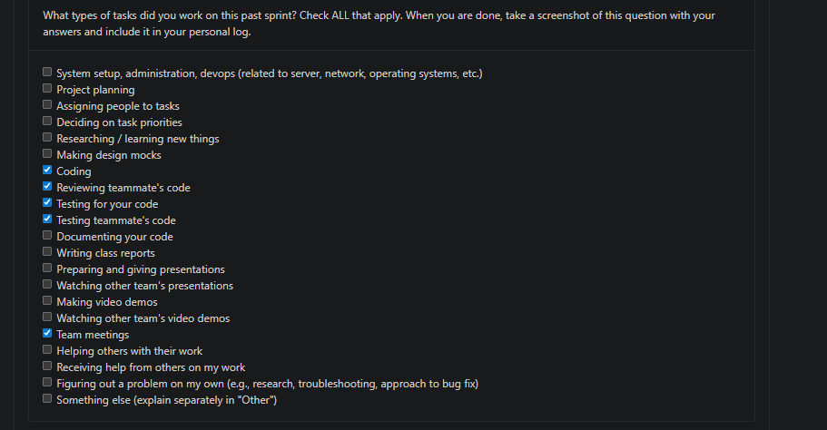

**Weekly Goals Recap**  
This week, I focused on improving backend test coverage and strengthening the reliability of the project API layer without introducing new functionality.

The main work this week was centered on adding a dedicated test suite for `src/api/routes/project.py`. I created a new pull request that added comprehensive tests for core project-related API routes, including upload, merge, thumbnail handling, project listing and retrieval, Gemini-related failure branches, ranking failure scenarios, and project data deletion. The purpose of this work was to improve confidence in backend behavior, especially around edge cases and error handling paths that were not previously covered.

This work was carefully scoped as a test-focused change only, so that it remained independent from feature development and minimized review complexity. I intentionally excluded preference-related test cases because the git username logic in that area was already being fixed in a separate change, and I did not want to add tests around behavior that was still unstable.

As a result of this testing work, coverage for `src/api/routes/project.py` improved from approximately **75% to 88%**, and the full local test suite continued to pass successfully. I verified the changes by running local pytest and coverage checks to ensure that the added tests improved branch coverage without introducing regressions.

**GitHub Pull Requests (Evidence of Work)**

- **PR1 – Add additional tests for project API routes to improve coverage #350**  
  [<<PR1 LINK>>](https://github.com/COSC-499-W2025/capstone-project-team-9/pull/350)

**Additional Contributions**
- Added backend tests for upload and merge route branches.
- Covered project listing, retrieval, and thumbnail-related edge cases.
- Added tests for Gemini analysis and ranking failure scenarios.
- Added tests for project data deletion and related error handling.
- Improved route-level confidence without modifying production logic.
- Verified all tests locally with pytest and coverage reporting.

---
### **Week 10 (Term 2): Mar 9th – Mar 15th**

**Tasks worked on:**

**Weekly Goals Recap**  
This week, I focused on improving the reliability of the portfolio customization workflow and addressing issues in the frontend–backend API interaction layer.

One of the main issues discovered during testing was that saving portfolio customization data sometimes triggered a **422 validation error** due to inconsistent request formatting between the frontend and backend. After investigating the API request flow, I identified that the frontend API wrapper did not always set the correct `Content-Type: application/json` header when sending request bodies. I updated the `apiCall()` helper to automatically attach the correct header whenever a request body is present and improved error parsing logic so that FastAPI validation errors are handled properly on the frontend.

In addition to fixing the API communication issue, I updated the frontend customization workflow to ensure that success messages are only shown when API responses are confirmed as successful. This prevents false success notifications when the backend returns an error. I also verified that customized projects are correctly marked in the dashboard and that the saved customization data can be retrieved and used by the portfolio view.

Alongside these fixes, I updated the backend test suite to reflect the adjusted API behavior when customization data does not exist. The corresponding tests were modified to validate the updated response behavior while ensuring the full test suite continued to pass locally.

Overall, this work improved the robustness of the portfolio customization feature and strengthened the reliability of API communication between the frontend and backend.

**GitHub Pull Requests (Evidence of Work)**

- **PR1 – Bug fixes: Save Customization doesn't return NOT FOUND anymore #357**  
  [<<PR1 LINK>>](https://github.com/COSC-499-W2025/capstone-project-team-9/pull/357)

- **PR2 – tests/test_misc_coverage_boost.py #356**  
  [<<PR2 LINK>>](https://github.com/COSC-499-W2025/capstone-project-team-9/pull/356)

**Additional Contributions**

- Fixed API request formatting issues in the frontend `apiCall()` wrapper.
- Improved error handling for FastAPI validation responses.
- Resolved a bug causing incorrect success messages during customization saving.
- Verified that customized portfolio projects update correctly in the dashboard UI.
- Updated backend tests to reflect adjusted API behavior.
- Ran the full local test suite with pytest to ensure no regressions were introduced.

---
### **Week 11 (Term 2): Mar 16th – Mar 22nd**

**Tasks worked on:**

_No screenshot available for this week._

---

**Weekly Goals Recap**  
This week, the project entered its final stabilization phase as development approached completion. The primary focus was on identifying and resolving remaining issues through peer evaluation and improving the reliability of the analysis pipeline.

During **Peer Testing 2**, several inconsistencies were identified in how analysis results were computed and displayed. One critical issue involved the **incorrect calculation of lines of code (LOC)** in the project analysis module. After tracing the full data flow from analysis to dashboard display, I identified that LOC was being incorrectly computed by attempting to cast file content directly to integers, which caused LOC values to be silently set to zero.

To resolve this, I updated the analysis logic to compute LOC based on actual file content by counting lines, including handling byte decoding where necessary. I also updated the corresponding test cases to reflect this corrected behavior by using realistic multiline content instead of numeric placeholders. After applying these changes, I re-ran local analysis and verified that LOC values were correctly reflected in both backend responses and the dashboard UI.

In addition, I ensured that all existing tests passed after the fix and validated that the changes did not introduce regressions. This work helped improve the accuracy and reliability of key project metrics presented to users.

Overall, this week’s work focused on polishing core functionality, fixing edge-case bugs, and preparing the system for final delivery.

---

**GitHub Pull Requests (Evidence of Work)**

- **PR – Fix LOC calculation and update tests for content-based line counting**  
  [<<PR LINK>>](https://github.com/COSC-499-W2025/capstone-project-team-9/pull/380)

---

**Additional Contributions**

- Identified and fixed a critical bug in LOC calculation within the analysis pipeline.
- Updated test cases to align with content-based line counting logic.
- Participated in **Peer Testing 2** and incorporated feedback into system improvements.
- Verified correctness of analysis results across backend and dashboard layers.
- Ensured full test suite passes locally with no regressions.
- Contributed to final-stage system stabilization and polish.

---
### **Week 12 (Term 2): Mar 23rd – Mar 29th**

**Tasks worked on:**

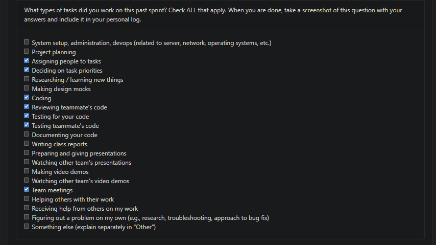

---

**Weekly Goals Recap**  
This week marked the final stage of the project, with a focus on completing the last round of testing and ensuring overall system stability before submission. Rather than introducing new features, the work concentrated on strengthening reliability and validating edge-case behavior.

The primary contribution this week was adding a small set of targeted test cases to improve coverage and ensure robustness in critical components. Specifically, I implemented tests for the database health check to simulate connection failure scenarios, verifying that the system returns appropriate error responses under failure conditions.

In addition, I added tests for the request context middleware to ensure that request IDs are consistently handled. These tests verify that an existing `X-Request-ID` is preserved across the request lifecycle, that a new request ID is generated when missing, and that request IDs are still included in error responses. This helps guarantee traceability and consistency for both normal and failure cases.

All tests were run locally, and the full test suite passed successfully. These final additions were intentionally lightweight and isolated, minimizing risk while improving confidence in system behavior.

Overall, this week focused on final validation, edge-case testing, and ensuring the project is stable, reliable, and ready for submission.

---

**GitHub Pull Requests (Evidence of Work)**

- **PR – test: add db failure and request context edge case tests #387**  
  [<<PR LINK>>](https://github.com/COSC-499-W2025/capstone-project-team-9/pull/387)

---

**Additional Contributions**

- Added test coverage for database connection failure scenarios.
- Verified correct error handling behavior for `/api/health/db`.
- Added middleware tests to ensure request ID preservation and generation.
- Ensured request IDs are included in both successful and error responses.
- Ran full test suite locally and confirmed all tests pass.
- Contributed to final system stabilization and submission readiness.
